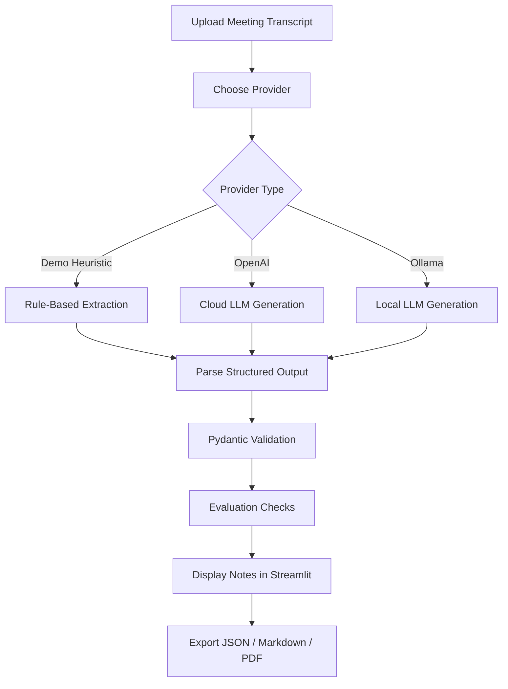

<div align="center">

# 🧠 AI Meeting Notes Assistant

### Turn raw meeting transcripts into structured, actionable notes using LLMs

<p>
  
  
  
  
  
</p>

A beginner-friendly yet practical **AI Engineer portfolio project** that converts messy meeting transcripts into clean summaries, decisions, action items, owners, deadlines, and exportable notes.

</div>

---

## 📌 Project Overview

**AI Meeting Notes Assistant** is a Streamlit-based AI application that transforms raw meeting transcripts into structured meeting notes.

Instead of producing only a simple text summary, the app extracts useful information that can be used in real workflows, such as:

- 📝 Meeting summary
- ✅ Key decisions
- 📌 Action items
- 👤 Responsible person / owner
- 📅 Deadline
- 🔍 Evidence from the transcript
- 📤 Export options: JSON, Markdown, and PDF

This project demonstrates important AI engineering skills, including prompt design, structured output parsing, schema validation, local and cloud LLM integration, evaluation checks, and simple app deployment.

---

## 🚀 Demo Flow

1. Upload a `.txt` meeting transcript or use the included sample transcript.
2. Select an AI provider:
   - **Demo heuristic** — works offline and is useful for testing.
   - **OpenAI** — uses the OpenAI API.
   - **Ollama** — uses a locally running LLM.
3. Generate structured meeting notes.
4. Review:
   - JSON output
   - Markdown notes
   - Quality checks
   - Export files

---

## ✨ Key Features

| Feature | Description |
|---|---|
| 📄 Transcript Upload | Upload raw `.txt` meeting transcripts. |
| 🧠 LLM-Powered Extraction | Generate structured meeting notes using OpenAI or Ollama. |
| 📴 Offline Demo Mode | Test the app without paid API keys using heuristic logic. |
| 🧩 Schema-First Output | Uses a strict JSON structure for reliable downstream usage. |
| ✅ Validation Layer | Uses Pydantic models to validate generated output. |
| 📊 Evaluation Checks | Measures whether action items include owners and deadlines. |
| 📤 Multi-Format Export | Export results as JSON, Markdown, and PDF. |
| 🖥️ Streamlit Interface | Simple and interactive user interface for quick testing. |

---

## 🛠️ Tech Stack

| Category | Tools |
|---|---|
| Language | Python |
| UI | Streamlit |
| LLM Providers | OpenAI, Ollama |
| Validation | Pydantic |
| Testing | Pytest |
| Export | JSON, Markdown, PDF |
| Project Type | AI Engineer Portfolio Project |

---

## 🧭 System Workflow



---

## 📂 Project Structure

```text
ai-meeting-notes-assistant/
├── app.py
├── data/
│   └── sample_transcript.txt
├── examples/
│   ├── sample_output.json
│   └── sample_output.md
├── src/
│   └── meeting_notes/
│       ├── exporter.py
│       ├── evaluation.py
│       ├── llm.py
│       ├── models.py
│       └── parser.py
└── tests/
    ├── test_exporter.py
    └── test_parser.py
```

---

## ⚙️ Installation

### 1. Clone the repository

```bash
git https://github.com/Kenil-Sutariya/ml-projects/edit/main/ai-meeting-notes-assistant.git
cd ai-meeting-notes-assistant
```

### 2. Create and activate a virtual environment

```bash
python -m venv .venv
source .venv/bin/activate
```

For Windows:

```bash
.venv\Scripts\activate
```

### 3. Install dependencies

```bash
pip install -r requirements.txt
```

### 4. Create environment file

```bash
cp .env.example .env
```

---

## 🔐 Environment Variables

For OpenAI, add your API key to `.env`:

```bash
OPENAI_API_KEY=your_key_here
OPENAI_MODEL=gpt-4o-mini
```

For Ollama, install Ollama, pull a model, and keep the local server running:

```bash
ollama pull llama3.1
ollama serve
```

---

## ▶️ Run the App

```bash
streamlit run app.py
```

Then open the local Streamlit URL shown in your terminal.

---

## 🧪 Run Tests

```bash
pytest
```

---

## 🧾 Expected JSON Output

```json
{
  "summary": "The team reviewed launch progress, assigned final tasks, and confirmed deadlines.",
  "decisions": [
    "Launch date remains Friday.",
    "Rahul will own the sales report."
  ],
  "action_items": [
    {
      "task": "Prepare the sales report, include regional numbers, and submit it to Mr. Kenil for review.",
      "owner": "Rahul",
      "deadline": "Friday, May 3",
      "evidence": "Rahul confirmed he would prepare the sales report by Friday."
    }
  ],
  "follow_ups": [
    "Confirm final design approval after QA feedback."
  ]
}
```

---

## 📊 Evaluation Logic

The project checks whether generated meeting notes are operationally useful, not only fluent.

Example quality checks include:

- Whether action items are detected.
- Whether each action item has an owner.
- Whether each action item has a deadline.
- Whether the output follows the expected schema.
- Whether the generated JSON can be parsed and validated.

---

## 🔮 Future Improvements

- Add speaker diarization for audio-based meetings.
- Support direct audio upload and transcription.
- Add calendar integration for automatic deadline reminders.
- Add Jira, Trello, or Notion export.
- Compare output quality across multiple LLM providers.
- Add authentication and user-specific meeting history.

---

## 👨‍💻 Author

**Kenil Sutariya**  
AI / ML Engineer Portfolio Project

<p>
  <a href="https://github.com/Kenil-Sutariya">
    
  </a>
  <a href="https://www.linkedin.com/in/Kenil-Sutariya/">
    
  </a>
</p>

---

<div align="center">

⭐ If you found this project useful, consider giving it a star!

</div>
