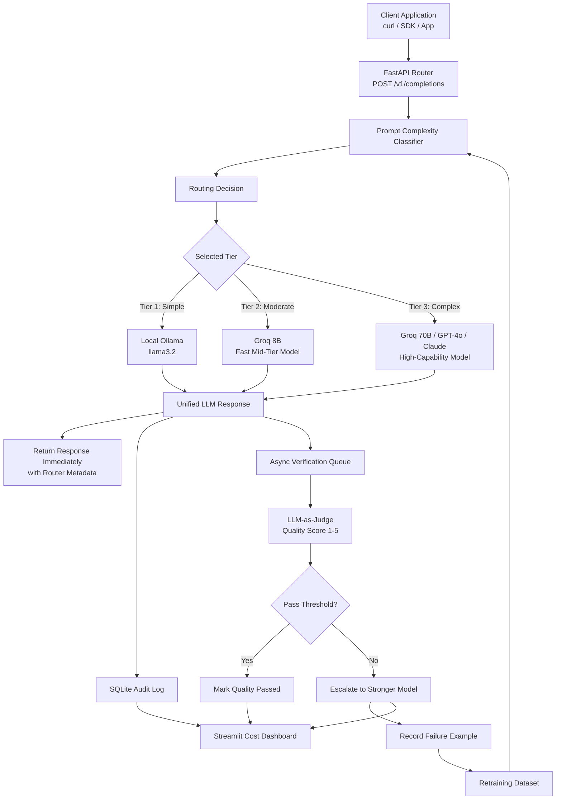
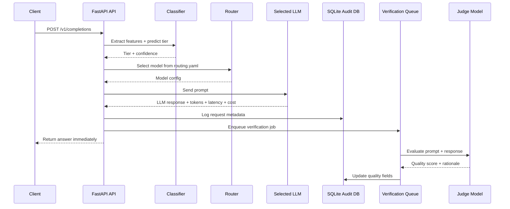

<div align="center">

# ⚡ LLM Cost Autopilot

### Intelligent LLM routing that cuts API cost without blindly sacrificing quality

<p>
  
  
  
  
  
  
  
</p>

<p>
  <b>Route every prompt to the cheapest model that can answer it well.</b><br/>
  Classify prompt complexity, select the right LLM tier, verify quality asynchronously, and feed failures back into retraining.
</p>

</div>

---

## 🧠 Project Summary

**LLM Cost Autopilot** is an intelligent routing layer for LLM applications. Instead of sending every request to an expensive frontier model, it analyzes the prompt, predicts its complexity, routes it to the most cost-effective model, and verifies the response quality in the background.

The result is a self-improving system that saves cost while preserving quality.

> **Measured result:** 96.6% lower cost compared with a GPT-4o-only baseline while maintaining 96.4% quality pass rate across 1,049+ logged requests.

This is my favorite project because it combines practical AI engineering with real production concerns:

- LLM provider abstraction
- ML-based prompt complexity classification
- Dynamic routing
- Cost tracking
- Quality verification
- Async background workers
- Audit logging
- Dashboard analytics
- Feedback-driven retraining

---

## 📊 Results at a Glance

| Metric | Result |
|---|---:|
| 💰 Cost reduction vs. GPT-4o baseline | **96.6%** |
| ✅ Quality pass rate | **96.4%** |
| 🧠 Classifier accuracy | **88.9%** |
| 🔁 Escalation rate | **1.6%** |
| 🧪 Load test success rate | **60 / 60 requests, 0 errors** |
| 💸 Load test savings vs. GPT-4o | **100% saved** |
| ⚡ Load test median latency | **2,421 ms** |

### Core insight

Not every prompt needs the strongest model.

| Prompt type | Better routing choice |
|---|---|
| “What is the capital of France?” | Small local/free model |
| “Summarize this short paragraph.” | Mid-tier fast model |
| “Design a distributed caching system with trade-offs.” | High-capability model |

The router makes this decision automatically.

---

## ✨ Key Features

| Area | What it does |
|---|---|
| 🧭 Intelligent Routing | Predicts prompt complexity and selects the right model tier |
| 🧠 ML Classifier | Random Forest classifier trained on prompt complexity features |
| 🔌 Unified LLM Interface | Supports OpenAI, Anthropic, Groq, and Ollama behind one client |
| 🔍 Quality Verification | Uses an async LLM-as-judge loop to score response quality |
| 🔁 Auto-Escalation | Re-runs failed responses on a stronger model when needed |
| 📉 Cost Tracking | Logs actual cost, baseline cost, savings, and cost deltas |
| 📊 Dashboard | Streamlit + Plotly dashboard for savings, quality, routing, and latency |
| 🧾 Audit Trail | SQLite database stores request metadata and verification results |
| 🛠️ Configurable Routing | YAML-based tier-to-model mapping with live updates |
| 🔄 Feedback Loop | Failed routing examples are saved for future retraining |

---

## 🏗️ Architecture



---

## 🧩 Component Mapping

| Component | File / Folder | Responsibility |
|---|---|---|
| API app | `src/api/app.py` | FastAPI app, lifespan, CORS, route registration |
| Completion route | `src/api/routes/completions.py` | Main OpenAI-compatible request endpoint |
| Model registry | `src/models/registry.py` | Provider/model config, pricing, latency, context window |
| Unified client | `src/models/client.py` | Sends requests to OpenAI, Anthropic, Groq, or Ollama |
| Response object | `src/models/response.py` | Standardized LLM response format |
| Feature extraction | `src/classifier/features.py` | Converts prompt text into 15 numerical features |
| Classifier training | `src/classifier/train.py` | Trains and evaluates model candidates |
| Prediction | `src/classifier/predict.py` | Predicts tier and probability for incoming prompts |
| Router | `src/router/router.py` | Maps predicted tier to configured model |
| Judge | `src/verifier/judge.py` | Scores response quality using LLM-as-judge |
| Thresholds | `src/verifier/thresholds.py` | Task-specific quality score thresholds |
| Verifier worker | `src/verifier/verifier.py` | Async queue, verification, escalation handling |
| Feedback loop | `src/verifier/feedback.py` | Saves failures and supports retraining |
| Database schema | `src/db/schema.py` | SQLite schema definition |
| Logging | `src/db/logger.py` | Logs requests and verification updates |
| Analytics queries | `src/db/queries.py` | Cost, quality, routing, and dashboard queries |
| Dashboard | `src/dashboard/app.py` | Streamlit dashboard with charts and audit table |
| Routing config | `config/routing.yaml` | Tier-to-model mapping and fallback settings |

---

## 🔄 Request Lifecycle



---

## 🧠 How It Works

### 1. Unified Model Interface

Every provider call goes through one standard function:

```python
send_request(prompt, model_config)
```

It hides provider-specific differences and returns a common `LLMResponse` object containing:

- Generated text
- Input and output tokens
- Latency
- Cost
- Provider name
- Model ID

Supported providers:

| Provider | Use case |
|---|---|
| Ollama | Local, free, private inference |
| Groq | Fast cloud inference with free-tier options |
| OpenAI | Strong commercial models |
| Anthropic | High-quality reasoning and writing models |

---

### 2. Complexity Classifier

Before routing, the prompt is converted into numerical features.

| Feature group | Examples |
|---|---|
| Length signals | token count, word count, character count |
| Structure signals | sentence count, question count, context provided |
| Task signals | simple verbs, moderate verbs, complex verbs |
| Constraint signals | “must”, “ensure”, “without”, “while” |
| Output signals | JSON, table, report, essay, specification |
| Complexity signals | multi-step, detailed plan, comprehensive, trade-off |
| Code/data signals | SQL, code blocks, functions, structured data |

The classifier predicts one of three tiers:

| Tier | Meaning | Example model |
|---|---|---|
| Tier 1 | Simple prompt | `llama3.2` via Ollama |
| Tier 2 | Moderate prompt | `groq-llama3-8b` |
| Tier 3 | Complex prompt | `groq-llama3-70b` / GPT-4o / Claude |

---

### 3. Routing Decision

The routing layer maps predicted tiers to models using `config/routing.yaml`.

```yaml
routing:
  tier_1: llama3.2
  tier_2: groq-llama3-8b
  tier_3: groq-llama3-70b

fallback:
  tier_1: groq-llama3-8b
  tier_2: groq-llama3-70b
  tier_3: groq-llama3-70b
```

This means routing behavior can be changed without modifying application code.

---

### 4. Async Quality Verification

The user gets the answer immediately. Verification happens in the background.

The verifier sends the original prompt and model response to a judge model, which returns:

```text
SCORE: 4
RATIONALE: The answer is accurate and complete, with minor missing detail.
```

If the score is below the threshold:

1. The request is marked as failed.
2. It is optionally escalated to a stronger model.
3. The failure is saved to `failures.csv`.
4. Future retraining uses this failure to improve routing.

---

### 5. Cost Dashboard

The Streamlit dashboard turns logs into portfolio-ready analytics.

| Dashboard panel | What it shows |
|---|---|
| Total savings | Actual cost vs. GPT-4o baseline |
| Routing distribution | Which models handled which requests |
| Quality histogram | Distribution of judge scores |
| Escalation trend | How often lower-tier choices failed |
| Daily cost chart | Actual cost over time vs. baseline |
| Tier breakdown | Cost, latency, quality by complexity tier |
| Audit log | Recent request-level metadata |

---

## 🧪 Classifier Performance

Three models were trained and compared using cross-validation.

| Model | CV Accuracy |
|---|---:|
| Random Forest | **88.65%** |
| Logistic Regression | 86.45% |
| Gradient Boosting | 85.81% |

### Held-out test results

| Class | Precision | Recall | F1 |
|---|---:|---:|---:|
| Tier 1 — Simple | 0.92 | 0.92 | 0.92 |
| Tier 2 — Moderate | 0.86 | 0.86 | 0.86 |
| Tier 3 — Complex | 0.89 | 0.89 | 0.89 |
| Overall | **0.89** | **0.89** | **0.89** |

### Most important features

| Rank | Feature | Importance |
|---:|---|---:|
| 1 | `char_count` | 24.8% |
| 2 | `word_count` | 22.0% |
| 3 | `token_count` | 13.1% |
| 4 | `moderate_verb_count` | 8.7% |
| 5 | `avg_word_length` | 7.0% |

---

## 🛠️ Tech Stack

| Layer | Tool / Library | Purpose |
|---|---|---|
| Language | Python 3.11+ | Main implementation |
| API | FastAPI + Uvicorn | OpenAI-compatible routing API |
| Local LLM | Ollama | Free local inference |
| Cloud LLMs | Groq, OpenAI, Anthropic | Provider comparison and stronger model tiers |
| ML | scikit-learn | Complexity classifier |
| Token counting | tiktoken | Token estimation |
| Database | SQLite + SQLAlchemy Core | Request audit log |
| Dashboard | Streamlit + Plotly | Cost and quality analytics |
| Async HTTP | httpx | Provider API calls |
| Retry logic | tenacity | Robust external API handling |
| Config | PyYAML | Editable routing configuration |
| Containerization | Docker Compose | Multi-service startup |

---

## 📁 Project Structure

```text
cost-autopilot/
├── src/
│   ├── api/
│   │   ├── app.py
│   │   ├── schemas.py
│   │   └── routes/
│   │       ├── completions.py
│   │       ├── models.py
│   │       ├── stats.py
│   │       └── config.py
│   │
│   ├── classifier/
│   │   ├── features.py
│   │   ├── train.py
│   │   └── predict.py
│   │
│   ├── models/
│   │   ├── registry.py
│   │   ├── client.py
│   │   └── response.py
│   │
│   ├── router/
│   │   └── router.py
│   │
│   ├── verifier/
│   │   ├── thresholds.py
│   │   ├── judge.py
│   │   ├── verifier.py
│   │   └── feedback.py
│   │
│   ├── db/
│   │   ├── schema.py
│   │   ├── logger.py
│   │   └── queries.py
│   │
│   └── dashboard/
│       └── app.py
│
├── config/
│   └── routing.yaml
│
├── data/
│   ├── labeled_prompts/
│   │   ├── prompts.csv
│   │   └── failures.csv
│   ├── autopilot.db
│   ├── classifier_report.json
│   └── load_test_report.json
│
├── scripts/
│   ├── load_test.py
│   └── seed_data.py
│
├── tests/
│   ├── test_baseline.py
│   └── test_verifier.py
│
├── Dockerfile
├── docker-compose.yml
├── requirements.txt
├── .env.example
└── README.md
```

---

## 🚀 Quick Start

### Prerequisites

- Python 3.11+
- Ollama installed locally
- Groq API key
- Optional: OpenAI and Anthropic API keys

---

### Option A — Run Locally

```bash
# 1. Clone the project
git clone https://github.com/Kenil-Sutariya/ml-projects.git
cd cost-autopilot

# 2. Create virtual environment
python -m venv .venv
source .venv/bin/activate

# Windows:
# .venv\Scripts\activate

# 3. Install dependencies
pip install -r requirements.txt

# 4. Configure environment
cp .env.example .env
```

Update `.env`:

```env
GROQ_API_KEY=gsk_your_key_here
OPENAI_API_KEY=sk_optional
ANTHROPIC_API_KEY=sk-ant_optional
OLLAMA_BASE_URL=http://localhost:11434
```

Start Ollama:

```bash
ollama serve
ollama pull llama3.2
```

Train the classifier:

```bash
python -m src.classifier.train
```

Start the API:

```bash
uvicorn src.api.app:app --port 8000 --reload
```

Start the dashboard in another terminal:

```bash
streamlit run src/dashboard/app.py
```

Open:

| Service | URL |
|---|---|
| API | `http://localhost:8000` |
| API Docs | `http://localhost:8000/docs` |
| Dashboard | `http://localhost:8501` |

---

### Option B — Run with Docker

```bash
cp .env.example .env
# Add your GROQ_API_KEY inside .env

docker-compose up --build
```

| Service | Port | Description |
|---|---:|---|
| `api` | 8000 | FastAPI router and verifier worker |
| `dashboard` | 8501 | Streamlit cost dashboard |
| `ollama` | 11434 | Local model server |

---

## 🔌 API Reference

### `POST /v1/completions`

Main endpoint. The router selects the model automatically.

#### Request

```json
{
  "messages": [
    {"role": "system", "content": "You are a helpful assistant."},
    {"role": "user", "content": "What is the CAP theorem?"}
  ],
  "verify_quality": true
}
```

#### Response

```json
{
  "id": "autopilot-afb452a04f85",
  "object": "chat.completion",
  "model": "groq-llama3-8b",
  "choices": [
    {
      "index": 0,
      "message": {
        "role": "assistant",
        "content": "The CAP theorem states..."
      },
      "finish_reason": "stop"
    }
  ],
  "usage": {
    "prompt_tokens": 52,
    "completion_tokens": 310,
    "total_tokens": 362,
    "latency_ms": 1338.0
  },
  "router_metadata": {
    "selected_model": "groq-llama3-8b",
    "provider": "groq",
    "complexity_tier": 2,
    "routing_confidence": 0.67,
    "estimated_cost_usd": 0.0,
    "routing_reason": "Moderate complexity — routed to mid-tier model for balanced quality/cost"
  }
}
```

---

### Other Endpoints

| Endpoint | Method | Purpose |
|---|---|---|
| `/health` | GET | Health check |
| `/v1/models` | GET | List registered models and pricing |
| `/v1/stats` | GET | Cost savings and quality summary |
| `/v1/routing-config` | GET | Read active tier-to-model mapping |
| `/v1/routing-config` | PUT | Update routing config without redeploy |

---

## ⚙️ Configuration

### Routing configuration

`config/routing.yaml` controls model selection.

```yaml
routing:
  tier_1: llama3.2
  tier_2: groq-llama3-8b
  tier_3: groq-llama3-70b

fallback:
  tier_1: groq-llama3-8b
  tier_2: groq-llama3-70b
  tier_3: groq-llama3-70b

quality:
  min_agreement_score: 0.75
  judge_model: groq-llama3-70b
```

### Environment variables

```env
GROQ_API_KEY=gsk_...
OPENAI_API_KEY=sk-...
ANTHROPIC_API_KEY=sk-ant-...
OLLAMA_BASE_URL=http://localhost:11434
```

---

## 🧪 Running Tests and Experiments

### Train classifier

```bash
python -m src.classifier.train
```

### Seed dashboard with synthetic history

```bash
python scripts/seed_data.py
```

### Run load test

```bash
python scripts/load_test.py
```

Custom load test:

```bash
python scripts/load_test.py --count 200 --concurrency 5
```

### Reproduce results

```bash
# 1. Train classifier
python -m src.classifier.train

# 2. Run baseline comparison
SKIP_OPENAI=1 SKIP_ANTHROPIC=1 python tests/test_baseline.py

# 3. Run verifier test
SKIP_OPENAI=1 SKIP_ANTHROPIC=1 python tests/test_verifier.py

# 4. Seed dashboard data
python scripts/seed_data.py

# 5. Run load test
python scripts/load_test.py --count 60 --concurrency 3

# 6. View report
cat data/load_test_report.json | python -m json.tool
```

---

## 📈 Load Test Summary

| Metric | Value |
|---|---:|
| Requests | 60 / 60 successful |
| Errors | 0 |
| Actual cost | $0.000000 |
| GPT-4o baseline | $0.286550 |
| Savings | $0.286550 |
| Cost reduction | 100.0% |
| Median latency | 2,421 ms |
| Tier accuracy | 85.0% |

### Routing distribution

| Model | Requests | Share |
|---|---:|---:|
| `llama3.2` | 29 | 48.3% |
| `groq-llama3-8b` | 25 | 41.7% |
| `groq-llama3-70b` | 6 | 10.0% |

> Note: High p95/p99 latency mostly comes from local Ollama running on CPU. With a GPU-backed local model or fast small-model API, latency would improve significantly.

---

## 🧠 Model Registry

| Key | Model | Provider | Tier | Input $/M | Output $/M | Avg Latency |
|---|---|---|---|---:|---:|---:|
| `groq-llama3-70b` | Llama 3.3 70B | Groq | High | $0.00* | $0.00* | 400ms |
| `groq-llama3-8b` | Llama 3.1 8B Instant | Groq | Medium | $0.00* | $0.00* | 150ms |
| `llama3.2` | Llama 3.2 3B | Ollama | Low | $0.00 | $0.00 | ~2500ms |
| `gpt-4o` | GPT-4o | OpenAI | High | $2.50 | $10.00 | 1800ms |
| `gpt-4o-mini` | GPT-4o mini | OpenAI | Medium | $0.15 | $0.60 | 800ms |
| `claude-sonnet-3-5` | Claude Sonnet | Anthropic | High | $3.00 | $15.00 | 1500ms |
| `claude-haiku-3` | Claude Haiku | Anthropic | Low | $0.80 | $4.00 | 500ms |

\* Groq free tier values depend on account limits and pricing availability.

---

## ➕ Adding a New Provider

### 1. Add provider enum

```python
class Provider(str, Enum):
    OPENAI = "openai"
    ANTHROPIC = "anthropic"
    OLLAMA = "ollama"
    GROQ = "groq"
    MISTRAL = "mistral"
```

### 2. Add model config

```python
"mistral-large": ModelConfig(
    provider=Provider.MISTRAL,
    model_id="mistral-large-latest",
    cost_per_input_token=2.0 / 1_000_000,
    cost_per_output_token=6.0 / 1_000_000,
    avg_latency_ms=1200,
    quality_tier=QualityTier.HIGH,
    context_window=128_000,
    display_name="Mistral Large",
)
```

### 3. Add provider handler

```python
async def _call_mistral(prompt, config, system):
    ...

_DISPATCH[Provider.MISTRAL] = _call_mistral
```

### 4. Update routing config

```yaml
routing:
  tier_3: mistral-large
```

---

## 🔮 Future Improvements

- Add LiteLLM-compatible provider interface
- Add semantic prompt embeddings as classifier features
- Add online learning or scheduled retraining
- Add PostgreSQL support for production deployment
- Add Redis queue for distributed verification workers
- Add user-level cost budgets and rate limits
- Add streaming responses
- Add Kubernetes deployment manifests
- Add Prometheus/Grafana monitoring
- Add A/B testing between routing strategies

---

## ❓ FAQ

### Why not send everything to GPT-4o?

Because most prompts do not need the strongest model. Routing simple prompts to cheaper models saves cost while preserving quality.

### Why use SQLite?

SQLite keeps the project easy to run locally. The schema can be migrated to PostgreSQL for production.

### Why use a Random Forest classifier?

It is fast, interpretable, and strong enough for structured prompt complexity features.

### What happens if the selected model fails?

Fallback routing and retry logic handle provider failures. Failed quality checks can also trigger escalation.

### Can verification be disabled?

Yes. Set:

```json
{"verify_quality": false}
```

### Is this production-ready?

It is a strong prototype / portfolio-grade implementation. For production, I would add distributed queues, stronger observability, auth, rate limits, and persistent cloud database support.

---

## 📄 License

MIT — free to use and modify.

---

<div align="center">

### Built as a practical AI Engineering project focused on cost, quality, routing, and real-world LLM system design.

</div>
