# Documentation — Universal ML Model Monitoring Platform

> **What this project does:** A fully-local web app for monitoring deployed machine-learning classifiers. Upload reference + current CSV files (or a trained model + raw CSVs), and the platform detects data drift, tracks performance decay, generates Evidently HTML reports, and writes plain-English explanations using a local Ollama model — or, optionally, any OpenAI-compatible cloud LLM with your own API key.

This is the long-form user guide. For a quick visual overview, see [`WORKFLOW.md`](WORKFLOW.md). For installation only, see [`README.md`](README.md).

---

## Table of Contents

1. [Why ML Monitoring](#1-why-ml-monitoring)
2. [Three Monitoring Modes](#2-three-monitoring-modes)
3. [Installation](#3-installation)
4. [The Nine Pages](#4-the-nine-pages)
5. [How Drift is Detected](#5-how-drift-is-detected)
6. [Model Health Logic](#6-model-health-logic)
7. [LLM Providers](#7-llm-providers)
8. [Privacy & Security](#8-privacy--security)
9. [Configuration](#9-configuration)
10. [Output Files](#10-output-files)
11. [Troubleshooting](#11-troubleshooting)
12. [Architecture & Code Map](#12-architecture--code-map)

---

## 1. Why ML Monitoring

Models look healthy at training time — held-out test accuracy ≥ 90 %, confusion matrix balanced, ROC-AUC respectable. Three months later, the same model is silently mis-classifying new traffic and nobody noticed because:

- **Data drift** — feature distributions in production no longer match the training set.
- **Concept drift** — the relationship between features and the target has changed (the world moved on, the rule changed).
- **Pipeline breakage** — a new column appeared, a categorical encoding changed, a deployment swapped a transformer.

The cheapest defense is to compare every fresh batch against a stable reference and look for symptoms early. That's all this platform does — but it does it for *any* classification model whose predictions you can write to CSV.

---

## 2. Three Monitoring Modes

### 2.1 Demo Mode

Bundled sample project with a reference dataset (1,500 rows) and 5 simulated production batches at increasing drift levels:

| Batch | What's drifted | Expected health |
|-------|----------------|-----------------|
| `batch_1_normal` | nothing | Healthy |
| `batch_2_slight_drift` | mild distribution shift | Warning |
| `batch_3_strong_drift` | heavy mean shift on 5 features | Critical |
| `batch_4_categorical_shift` | region/subscription distribution flipped | Warning |
| `batch_5_concept_shift` | rule between features and target changed | Critical |

Use this mode to evaluate the platform without preparing your own data.

### 2.2 Bring Your Own Predictions

Use this when your team's serving stack already runs the model — you just want to monitor it.

**You upload:**
- A **reference CSV** with columns: `target` (ground truth), `prediction` (model output), and optionally `prediction_proba` (probability of class 1).
- One or more **current batch CSVs** with the same column structure.

**You configure:**
- Which column is the target / prediction / probability
- Which columns are numerical / categorical features

The platform validates everything and then runs the standard pipeline.

### 2.3 Bring Your Own Model

Use this when you have a trained scikit-learn model and just want to throw raw CSVs at it.

**You upload:**
- A trusted `.pkl` or `.joblib` file containing a scikit-learn `Pipeline` (preprocessing + classifier).
- Reference + current batch CSVs containing only the **raw features and the target** (no predictions yet).

**You configure:**
- Target column (used for accuracy/F1/etc.)
- Feature columns (passed as-is to `model.predict`)

**What the platform does:**
1. Loads the model (after you tick the security checkbox)
2. Calls `model.predict(X)` on reference + every batch
3. Calls `model.predict_proba(X)` if available
4. Runs the standard monitoring pipeline using those predictions

> ⚠️ **Pickle / joblib files can execute arbitrary Python code on load.** The platform requires you to confirm "I trust this file" before any model is deserialised. Only upload model files you have created yourself or from a trusted teammate.

---

## 3. Installation

### Prerequisites

- Python 3.10 or 3.12 (Python 3.14 is too new for `evidently==0.6.7` — its NumPy build chokes)
- Optional: [Ollama](https://ollama.com/) for local LLM insights

### Steps

```bash
git clone https://github.com/Kenil-Sutariya/ml-projects
cd universal-ml-monitoring-platform

python3.12 -m venv venv
source venv/bin/activate           # Windows: venv\Scripts\activate

pip install -r requirements.txt
streamlit run app.py
```

The app opens at `http://localhost:8501` (Streamlit picks the next free port if 8501 is busy).

### Optional: Ollama for local AI insights

```bash
# install
brew install ollama                 # macOS — see ollama.com for other platforms

# start the daemon
ollama serve

# pull at least one model (recommended order — fastest first)
ollama pull llama3.2:latest
ollama pull phi3:latest
ollama pull gemma2:2b
```

The platform auto-detects whichever models you have installed.

### Optional: Cloud LLM keys

```bash
cp .env.example .env
# edit .env and paste any of: GROQ_API_KEY, OPENROUTER_API_KEY, GEMINI_API_KEY, OPENAI_API_KEY
```

`.env` is gitignored. Keys are loaded into memory only and never written to logs or disk.

---

## 4. The Nine Pages

### 4.1 🏠 Home

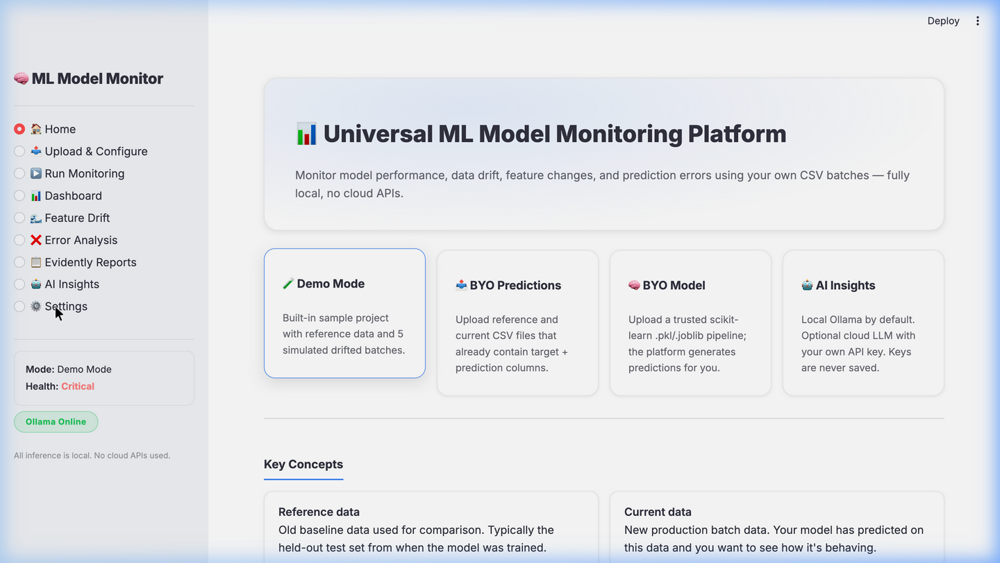

The landing page explains the four pillars (Demo Mode, BYO Predictions, BYO Model, AI Insights) and the four key concepts (reference data, current data, data drift, model degradation). The sidebar shows your current state: mode, reference row count, batch count, latest health, Ollama online/offline.

### 4.2 📤 Upload & Configure

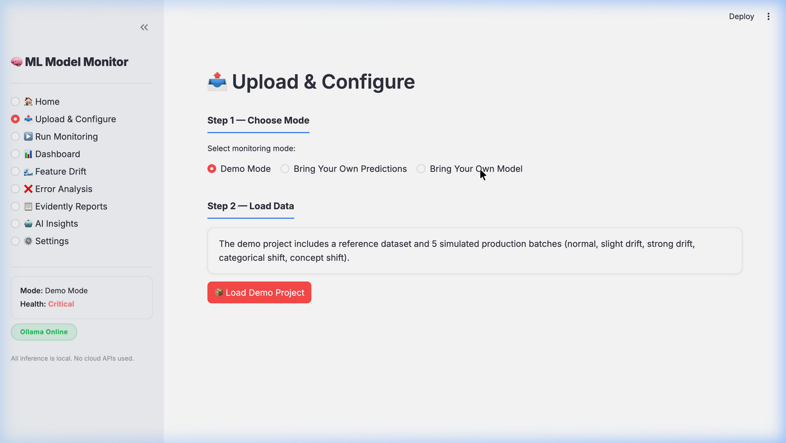

A four-step wizard:

1. **Choose Mode** — radio (Demo / BYO Predictions / BYO Model). Single click switches the rest of the page.
2. **Load Data** — file uploaders specific to the chosen mode.
3. **Configure Columns** — auto-detected, but every dropdown is editable.
4. **Validate Setup** — runs the schema validator and shows any errors / warnings.

The validator (`src/schema_validator.py`) checks:
- Required columns exist in reference and every batch
- Class labels in batches are a subset of those in reference (warns on unseen classes)
- Missing-value count per dataset
- Extra columns in batches that don't exist in reference

#### BYO Model branch

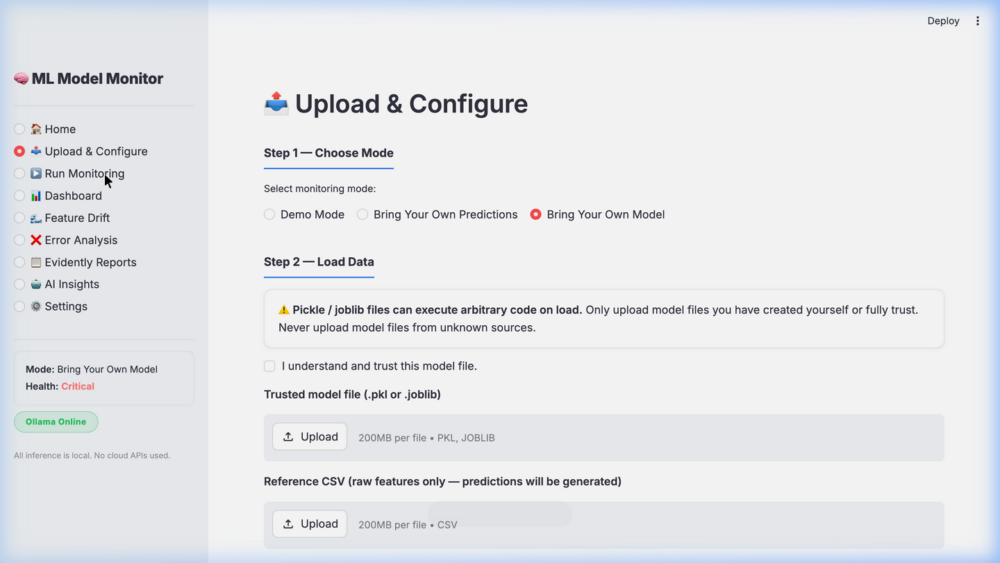

Note the security warning and the trust checkbox — the model file is not loaded until you tick the checkbox.

### 4.3 ▶️ Run Monitoring

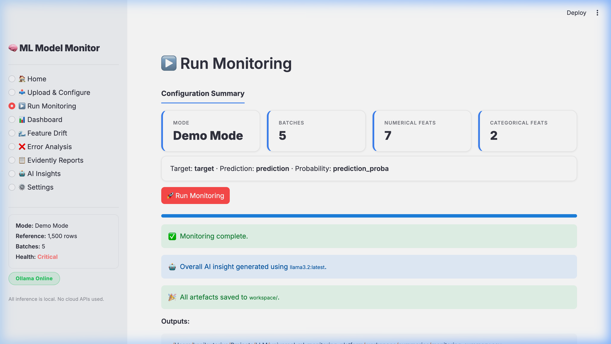

Shows your final configuration as KPI cards (Mode, Batches, Numerical Feats, Categorical Feats), then the big "🚀 Run Monitoring" button. While it runs, a progress bar walks through each step:

```
Validating data → Generating reference predictions (BYOM only) →
Calculating metrics for batch_1 → Detecting drift for batch_1 →
Generating Evidently reports for batch_1 → … → Saving monitoring summary → Finished
```

After completion you'll see "🎉 All artefacts saved to `workspace/`" plus a code block listing the output paths. If Local Ollama is the active provider and connected, an overall AI insight is auto-generated.

### 4.4 📊 Dashboard

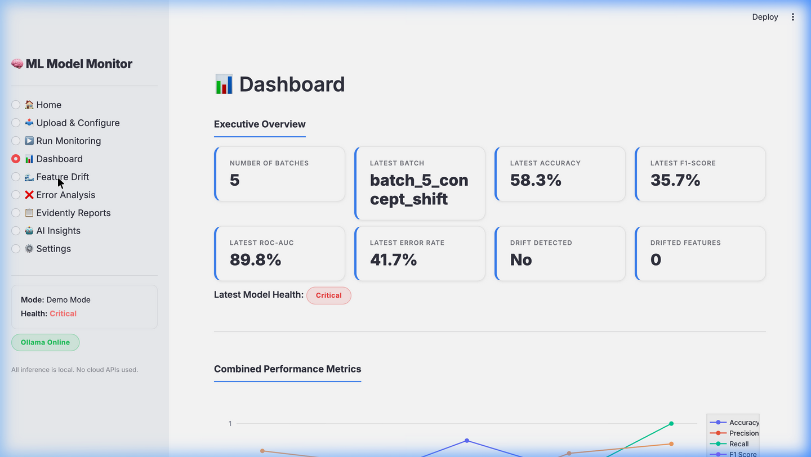

Eight KPI cards on top (Number of Batches, Latest Batch, Accuracy, F1-Score, ROC-AUC, Error Rate, Drift Detected, Drifted Features), then the Combined Performance chart with all 5 metrics over time, then individual metric charts (one per metric, with a 0.7 reference line for accuracy/F1/AUC and warning/critical thresholds for error rate). Bottom: full batch summary table.

### 4.5 🌊 Feature Drift

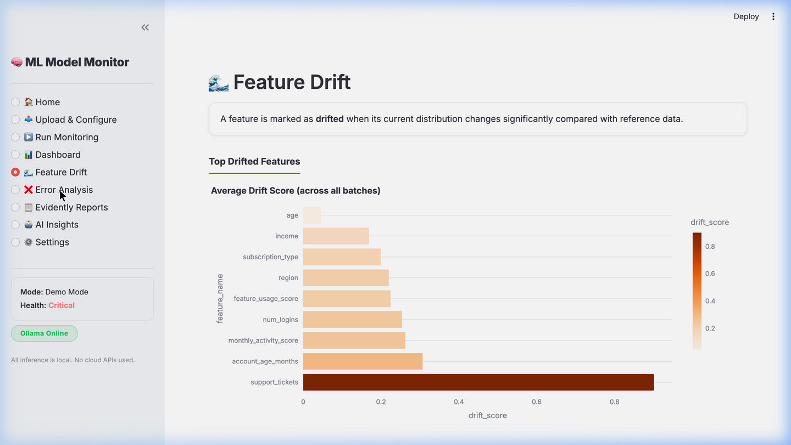

Three views:

1. **Top Drifted Features** — bar chart, average drift score across all batches, sorted descending.
2. **Drift Score by Batch (Heatmap)** — feature × batch grid coloured by drift intensity.
3. **Feature Drift Details Table** — per-batch, per-feature drift rows with formatted scores.

### 4.6 ❌ Error Analysis

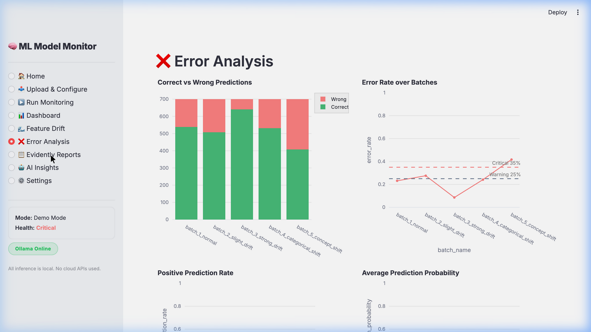

Top row: Correct vs Wrong stacked bars per batch + Error Rate trend with dashed warning/critical lines.
Middle row: Positive Prediction Rate + Average Prediction Probability over time.
Bottom: per-batch deep-dive — confusion matrix table, TP/FP/TN/FN cards, first 50 wrong predictions.

For non-binary tasks the confusion-matrix view is replaced with a friendly "binary only" warning.

### 4.7 📋 Evidently Reports

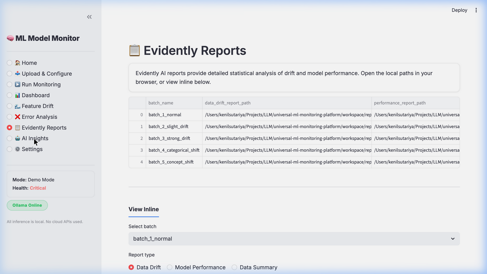

Lists the local file paths of every generated HTML report. Pick a batch + report type and the report renders inline (3 MB+ Evidently HTMLs work fine).

### 4.8 🤖 AI Insights

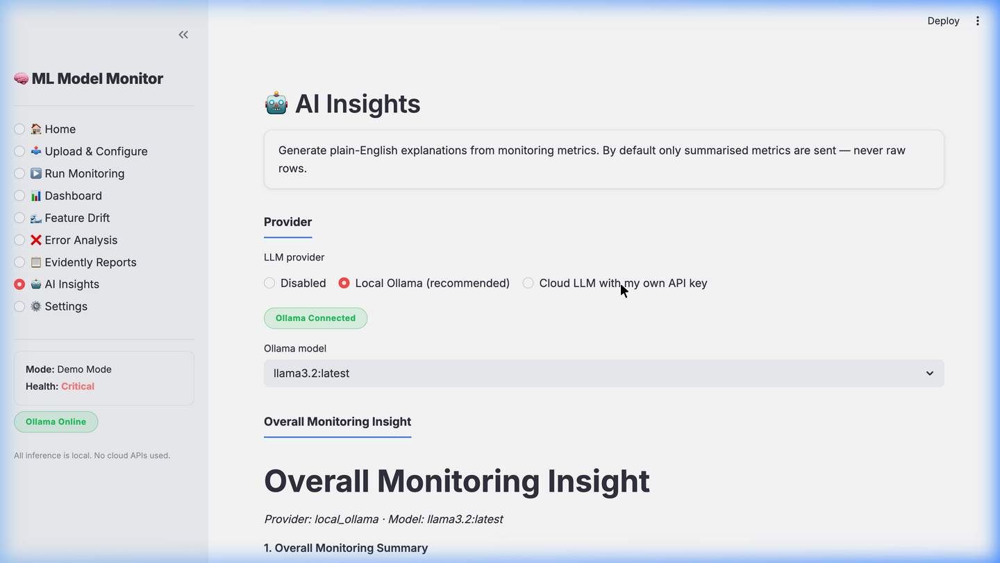

Three providers selectable via radio:

- **Disabled** — no AI explanations
- **Local Ollama** — uses `http://localhost:11434/api/chat` with whichever model you pick from the dropdown
- **Cloud LLM** — pick a preset (OpenAI / Groq / OpenRouter / Gemini / Custom) and the API key, base URL, and default model auto-fill from `.env`

Buttons:
- **✨ Generate** — overall or one-batch insight (your choice)
- **🚀 Generate ALL** — overall + every batch in one go

#### Cloud LLM branch with preset auto-fill

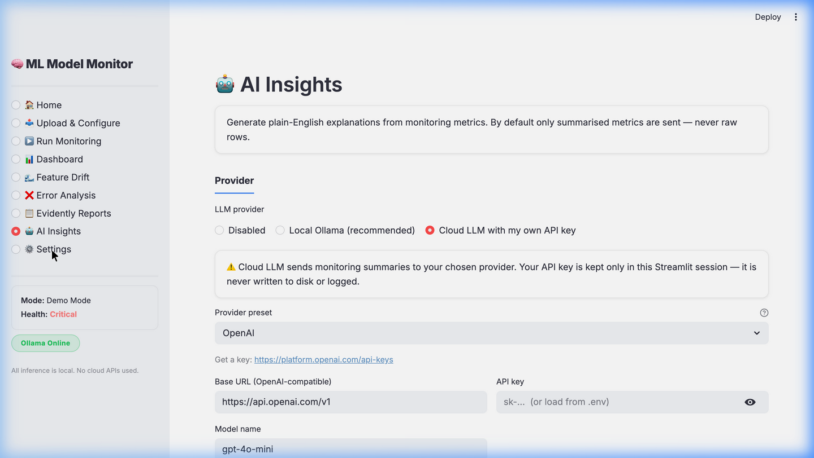

The "🔑 Detected API keys in .env for: …" banner shows which providers have keys ready. Switching presets auto-fills base URL + default model + API key (if present in `.env`).

### 4.9 ⚙️ Settings

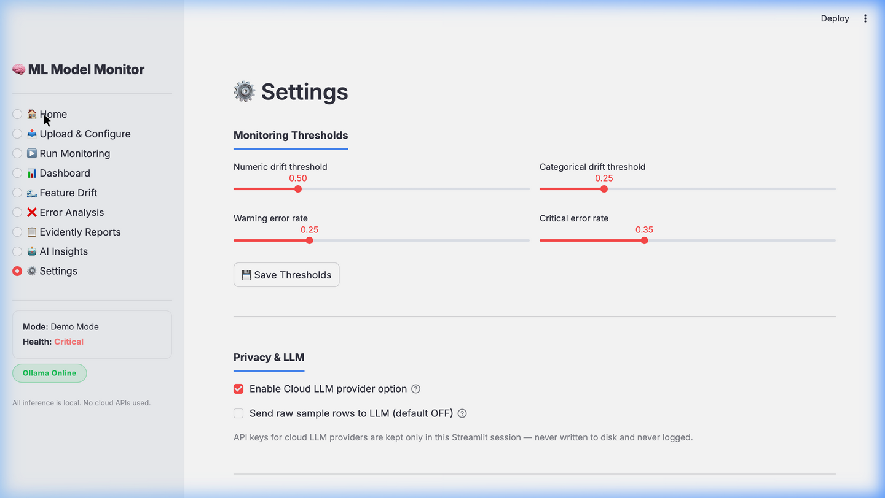

Three sections:

1. **Monitoring Thresholds** — sliders for the 4 thresholds that drive `model_health`. Saved to session state and applied on the next run.
2. **Privacy & LLM** — toggle whether the Cloud LLM option is even visible; toggle whether raw rows can be sent to LLMs (default OFF).
3. **Workspace** — clear workspace, reset demo project, plus an info JSON showing config path and Ollama status.

---

## 5. How Drift is Detected

The platform runs **two custom drift detectors** alongside the Evidently reports.

### 5.1 Numerical drift — mean-shift score

```python
mean_shift_score = abs(current_mean - reference_mean) / max(reference_std, 1e-9)
```

A score of `0.5` means the batch mean has moved half a reference-standard-deviation. Default threshold: **0.5 → drift detected**.

This catches gradual shifts that aren't statistically obvious in a small sample but accumulate across many batches.

### 5.2 Categorical drift — total variation distance

```python
score = sum(abs(reference_dist[c] - current_dist[c]) for c in all_categories)
```

Each value is in `[0, 2]`. A score of `0.25` means the cumulative absolute difference between the two distributions is 25 percentage points. Default threshold: **0.25 → drift detected**.

This catches the "the user mix changed" case — e.g. your model trained when 50 % of users were on Premium, and now Premium is 70 %.

### 5.3 Why both, and what about Evidently?

Evidently runs its own statistical drift tests (KS for numerical, chi-squared for categorical) and produces beautiful HTML reports — those are saved to `workspace/reports/data_drift/`. The custom detectors above feed `monitoring_summary.csv` and `feature_drift_details.csv`, which are what the Streamlit dashboards plot. Two views, same underlying data.

---

## 6. Model Health Logic

```python
def determine_model_health(error_rate, f1, drift_detected, …):
    if error_rate > critical_error_rate or f1 < critical_f1_threshold:
        return "Critical"
    if drift_detected == "Yes" or error_rate > warning_error_rate or f1 < warning_f1_threshold:
        return "Warning"
    return "Healthy"
```

Defaults:

| Threshold | Default | Meaning |
|-----------|---------|---------|
| `warning_error_rate` | 0.25 | Above this → at least Warning |
| `critical_error_rate` | 0.35 | Above this → Critical |
| `warning_f1_threshold` | 0.70 | Below this → at least Warning |
| `critical_f1_threshold` | 0.60 | Below this → Critical |

All four are sliders on the Settings page. Sensible starting points; tune per your domain.

---

## 7. LLM Providers

### 7.1 Local Ollama

Recommended default. No API key, no cloud, no rate limits. Tested with the user's installed models:

| Model | Approx response time | Notes |
|-------|---------------------:|-------|
| `llama3.2:latest` | 3-5 s | Best speed/quality balance |
| `phi3:latest` | 2-3 s | Fastest, slightly less detailed |
| `gemma2:2b` | 4-5 s | Compact, good summary style |
| `qwen3.5:latest` | 600 s+ on a 16 GB Mac | Too slow for interactive use |

Override the timeout if you have a large model:

```bash
# in .env
OLLAMA_TIMEOUT=600
```

### 7.2 Cloud LLM (OpenAI-compatible)

Five presets, all using the same `POST {base_url}/chat/completions` endpoint:

| Preset | Default base URL | Default model | Sign up |
|--------|------------------|---------------|---------|
| OpenAI | `https://api.openai.com/v1` | `gpt-4o-mini` | https://platform.openai.com/api-keys |
| Groq | `https://api.groq.com/openai/v1` | `llama-3.3-70b-versatile` | https://console.groq.com/keys |
| OpenRouter | `https://openrouter.ai/api/v1` | `openai/gpt-4o-mini` | https://openrouter.ai/keys |
| Gemini | `https://generativelanguage.googleapis.com/v1beta/openai` | `gemini-2.5-flash` | https://aistudio.google.com/apikey |
| Custom | — | — | (your endpoint) |

> 💡 **Speed tip:** Groq with `llama-3.3-70b-versatile` returns a full 7-section monitoring analysis in ≈ 1.5 seconds — typically 10-20× faster than local Ollama. Use it for interactive exploration, fall back to Ollama when offline.

### 7.3 How AI Insights actually work

```
monitoring_summary.csv  ─┐
                         ├─►  build_monitoring_prompt()  ─►  generate_explanation()  ─►  workspace/ai_insights/*.md
feature_drift_details.csv ─┘                                       │
                                                                   ├─ disabled       → placeholder
                                                                   ├─ local_ollama   → ollama_client.generate_ollama_response
                                                                   └─ cloud          → cloud_llm_client.generate_cloud_response
```

The **summary tables** are sent — never raw rows by default. The "send raw sample rows" toggle in Settings is OFF by default.

---

## 8. Privacy & Security

| Concern | Mitigation |
|---------|------------|
| API keys leaking to logs | `cloud_llm_client.py` has zero `print()` / `logging` calls; only the request and response objects exist in memory |
| Keys persisted to disk | Loaded into Streamlit `session_state` and `os.environ` only; never written back |
| Raw user data sent to cloud LLM | Off by default — Settings toggle is OFF; the prompt builder uses summary tables only |
| Untrusted `.pkl` execution | `model_loader.load_model()` is only called *after* the user ticks the trust checkbox; loader returns errors gracefully on bad input |
| `.env` accidentally committed | `.gitignore` excludes `.env` while keeping `.env.example` |

---

## 9. Configuration

### 9.1 `config/app_config.yaml`

```yaml
app:
  name: "Universal ML Model Monitoring Platform"
  page_icon: "📊"
  layout: "wide"

monitoring:
  drift_numeric_threshold:     0.5
  drift_categorical_threshold: 0.25
  warning_error_rate:          0.25
  critical_error_rate:         0.35
  warning_f1_threshold:        0.70
  critical_f1_threshold:       0.60

llm:
  default_provider: "local_ollama"
  local_ollama_url: "http://localhost:11434"
  default_ollama_model_priority:
    - "llama3.2:latest"
    - "qwen3.5"
    - "qwen:latest"
    - "gemma2:2b"
    - "phi3:latest"
```

### 9.2 `.env`

See `.env.example` for the full list. Keys are looked up by environment variable name:

```
OPENAI_API_KEY=…       OPENAI_BASE_URL=…       OPENAI_DEFAULT_MODEL=…
GROQ_API_KEY=…         GROQ_BASE_URL=…         GROQ_DEFAULT_MODEL=…
OPENROUTER_API_KEY=…   OPENROUTER_BASE_URL=…   OPENROUTER_DEFAULT_MODEL=…
GEMINI_API_KEY=…       GEMINI_BASE_URL=…       GEMINI_DEFAULT_MODEL=…
CUSTOM_API_KEY=…       CUSTOM_BASE_URL=…       CUSTOM_DEFAULT_MODEL=…
OLLAMA_TIMEOUT=180     OLLAMA_BASE_URL=http://localhost:11434
```

---

## 10. Output Files

```
workspace/
├── uploads/
│   ├── reference/               # raw uploaded reference CSV
│   ├── current_batches/         # raw uploaded batch CSVs
│   └── uploaded_model/          # uploaded model files (BYOM mode)
├── processed/
│   └── <batch>.csv              # batch as it was used in the pipeline
├── reports/
│   ├── data_drift/<batch>_data_drift.html
│   ├── model_performance/<batch>_performance.html
│   └── data_summary/<batch>_data_summary.html
├── summaries/
│   ├── monitoring_summary.csv   # 1 row per batch
│   └── feature_drift_details.csv# 1 row per (batch, feature)
└── ai_insights/
    ├── overall_monitoring_insight.md
    └── <batch>_insight.md
```

The **only** files used by the Streamlit dashboards are:
- `summaries/monitoring_summary.csv`
- `summaries/feature_drift_details.csv`
- `processed/<batch>.csv` (loaded only when you select a batch in the Error Analysis page)
- `ai_insights/*.md` (rendered on the AI Insights page)
- `reports/**/*.html` (rendered inline on the Evidently Reports page)

So if you want to rebuild the dashboards externally (e.g. in a notebook), the two CSVs are all you need.

---

## 11. Troubleshooting

| Symptom | Likely cause | Fix |
|---------|--------------|-----|
| `ImportError: cannot import name 'DataSummaryPreset' from 'evidently'` | older Evidently version | Already handled — falls back to `DataQualityPreset` automatically |
| Mode radio takes 2 clicks to switch | older revision of `app.py` | Update — fixed by binding the radio with `key="mode"` |
| Ollama always times out | model is loading or too large for your machine | Increase `OLLAMA_TIMEOUT` in `.env`, or use a smaller model (`phi3:latest`) |
| Cloud LLM HTTP 402 (OpenRouter) | account has no credits | Top up at https://openrouter.ai/settings/credits |
| Cloud LLM HTTP 429 (Gemini) | per-model free-tier quota | Switch model to `gemini-2.5-flash` |
| `pip install evidently==0.6.7` fails | Python 3.14 (NumPy compile error) | Use Python 3.10 or 3.12 |
| Dashboard says "No monitoring run found" | pipeline hasn't been run yet | Go to Run Monitoring → 🚀 Run Monitoring |
| Workspace getting stale | leftover artefacts from previous run | Settings → 🧹 Clear Workspace |

---

## 12. Architecture & Code Map

```
universal-ml-monitoring-platform/
├── app.py                          # Streamlit entry point — 9-page UI
├── config/app_config.yaml          # thresholds + LLM defaults
├── prompts/monitoring_analyst_prompt.txt   # LLM prompt template
├── src/
│   ├── utils.py                    # paths, .env loader, CSV helpers
│   ├── schema_validator.py         # column inference + validation
│   ├── data_profiler.py            # lightweight DF profiling
│   ├── metrics_calculator.py       # classification metrics + health logic
│   ├── drift_analyzer.py           # numerical + categorical drift
│   ├── evidently_runner.py         # Evidently HTML reports (fault-tolerant)
│   ├── model_loader.py             # trusted .pkl/.joblib loader
│   ├── prediction_engine.py        # generate predictions from uploaded model
│   ├── monitoring_pipeline.py      # end-to-end orchestration
│   ├── ollama_client.py            # local Ollama HTTP client
│   ├── cloud_llm_client.py         # OpenAI-compatible cloud client
│   ├── llm_providers.py            # 5 cloud preset definitions, .env loader
│   ├── llm_router.py               # routes between disabled/ollama/cloud
│   └── ai_insights.py              # prompt building + insight generation
├── sample_project/                 # bundled Demo Mode data + sample model
├── workspace/                      # all runtime outputs (gitignored)
├── tests/
│   ├── train_test_models.py        # train RF/LogReg/SVC for BYO Model testing
│   ├── test_full_stack.py          # 14-test end-to-end smoke
│   ├── test_cloud_keys.py          # live test of every .env-configured provider
│   ├── compare_providers.py        # side-by-side LLM comparison
│   └── capture_screenshots.py      # generate the docs screenshots (Playwright)
└── assets/screenshots/             # captured by capture_screenshots.py
```

### Adding your own provider

1. Append a new `CloudProviderPreset` entry in `src/llm_providers.py`.
2. Add the corresponding env vars to `.env.example`.
3. Restart Streamlit. Done — it appears in the AI Insights provider dropdown.

### Adding a new drift detector

1. Add a function to `src/drift_analyzer.py` that returns a list of dicts with the standard schema (`feature_name`, `feature_type`, `reference_value`, `current_value`, `drift_score`, `drift_detected`).
2. Call it in `src/monitoring_pipeline.py` alongside the existing detectors.
3. Its results will automatically flow into `feature_drift_details.csv` and the Feature Drift dashboard.

---

For a visual walkthrough of the workflow, see [`WORKFLOW.md`](WORKFLOW.md).
For installation only, see [`README.md`](README.md).
