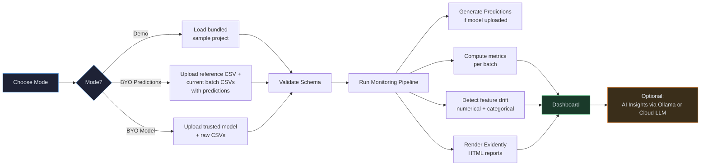
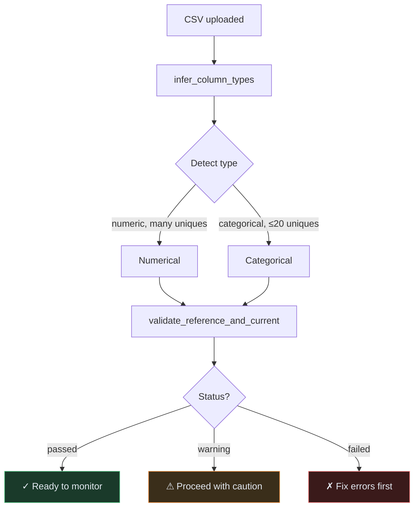
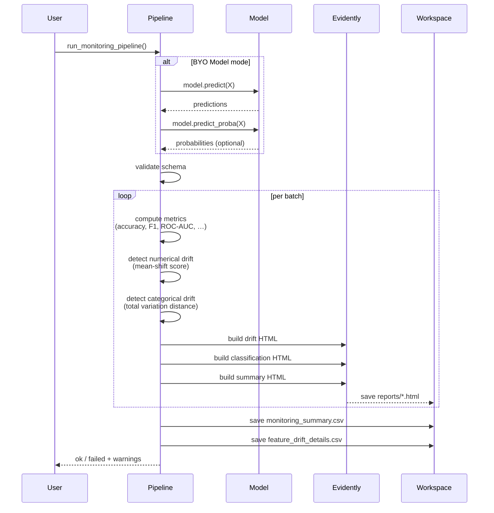
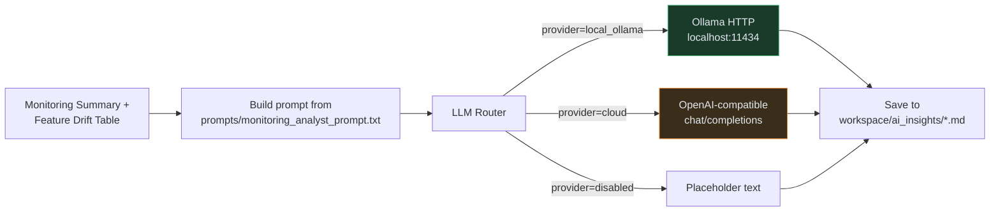

# Workflow — Universal ML Model Monitoring Platform

> **What this project does:** A fully-local web app that monitors your machine-learning models *after they're deployed* — it compares fresh production batches against a stable reference dataset, detects feature drift, tracks performance decay, and explains the results in plain English using a local LLM (or an optional cloud LLM with your own key).

This document walks through the end-to-end workflow with diagrams and real screenshots, so you understand *what happens at each step and what you'll see on screen*.

---

## High-Level Flow



---

## Step-by-Step Walkthrough

### Step 1 · Land on the Home page

Open `http://localhost:8501` (or whichever port Streamlit picked) and you'll see four feature cards explaining what the platform can do, plus a Key Concepts section that defines reference data, current data, drift, and degradation.


The sidebar always shows your current mode, latest batch health, and whether Ollama is online — so you know the state of the world at a glance.

---

### Step 2 · Upload & Configure (3 modes)

Pick one of three modes depending on what you have:

| Mode | When to use |
|---|---|
| **Demo Mode** | Just exploring — want to see drift detection on simulated batches |
| **BYO Predictions** | Your CSVs already contain `target` + `prediction` (and optionally `prediction_proba`) |
| **BYO Model** | You have a trained scikit-learn `.pkl` / `.joblib` and raw feature CSVs |


If you pick **Bring Your Own Model**, you'll see a security warning + trust checkbox before any model file is loaded:


After your data is loaded, the wizard auto-detects numerical/categorical columns and runs schema validation.



---

### Step 3 · Run Monitoring

Click "🚀 Run Monitoring" and a progress bar walks through the pipeline stages. For BYO Model mode, predictions are generated for every dataset *first*, then the rest of the pipeline runs.




---

### Step 4 · Dashboard — your executive view

Once the pipeline finishes, the Dashboard page surfaces the headline numbers: accuracy / F1 / ROC-AUC / error rate over time, plus a model-health badge per batch.


Model health is computed as:

```
if error_rate > critical_error_rate  OR f1 < critical_f1_threshold:  Critical
elif drift_detected == "Yes" OR error_rate > warning_error_rate OR f1 < warning_f1_threshold: Warning
else: Healthy
```

(Thresholds are adjustable from Settings.)

---

### Step 5 · Feature Drift — what's changing

Use Feature Drift to see *which features* are drifting and how strongly. The bar chart ranks the average drift score across all batches; the heatmap shows feature × batch drift intensity.


Two drift detectors run side-by-side:

| Type | Method | Threshold |
|------|--------|-----------|
| Numerical | `mean_shift = abs(cur_mean - ref_mean) / ref_std` | > 0.5 → drift |
| Categorical | total variation distance between distributions | > 0.25 → drift |

---

### Step 6 · Error Analysis — where the model is wrong

Confusion matrix per batch, plus a row-level view of the first 50 wrong predictions for the selected batch.


You also get the prediction-rate trend (is the model becoming over- or under-confident?) and the average probability trend (is its certainty drifting?).

---

### Step 7 · Evidently Reports — the deep dive

Each batch produces 3 Evidently HTML reports (data drift / classification performance / data summary) — viewable inline or as standalone files.


---

### Step 8 · AI Insights — plain-English explanations

Pick a provider and let an LLM explain the monitoring results in plain English. The same monitoring data flows to whichever provider you choose.




Switch to Cloud LLM and pick any of 5 presets (OpenAI · Groq · OpenRouter · Gemini · Custom). Keys are auto-loaded from `.env` if present, never written to disk:


---

### Step 9 · Settings — fine-tuning

Adjust drift thresholds, control which LLM providers are visible, toggle whether raw rows can be sent to the LLM (off by default), and clear the workspace.


---

## Output Artefacts (what the pipeline produces)

```
workspace/
├── processed/
│   └── <batch>.csv                    # the CSV used in the pipeline (with predictions)
├── reports/
│   ├── data_drift/<batch>_data_drift.html         # Evidently drift report
│   ├── model_performance/<batch>_performance.html # Evidently classification report
│   └── data_summary/<batch>_data_summary.html     # Evidently summary report
├── summaries/
│   ├── monitoring_summary.csv          # 1 row per batch — all KPIs
│   └── feature_drift_details.csv       # 1 row per (batch, feature)
└── ai_insights/
    ├── overall_monitoring_insight.md   # LLM analysis across all batches
    └── <batch>_insight.md              # Per-batch LLM analysis
```

`monitoring_summary.csv` schema:

| column | type | meaning |
|--------|------|---------|
| `batch_name` | str | filename stem |
| `accuracy`, `precision`, `recall`, `f1_score`, `roc_auc` | float | sklearn metrics |
| `total_predictions`, `correct_predictions`, `wrong_predictions` | int | counts |
| `error_rate`, `positive_prediction_rate`, `average_prediction_probability` | float | derived rates |
| `is_binary` | bool | whether the task is binary classification |
| `true_positive`, `false_positive`, `true_negative`, `false_negative` | int | confusion-matrix cells (binary only) |
| `number_of_drifted_features`, `drift_detected`, `drifted_features` | int / str | drift summary |
| `model_health` | str | Healthy / Warning / Critical |
| `data_drift_report_path`, `performance_report_path`, `data_summary_report_path` | str | absolute paths to the HTML reports |

---

## End-to-End Quick Start (≤ 60 seconds)

```bash
# 1. Install
python3.12 -m venv venv
source venv/bin/activate
pip install -r requirements.txt

# 2. Run
streamlit run app.py
# → opens http://localhost:8501

# 3. In the browser:
#    Upload & Configure  →  Demo Mode  →  Load Demo Project
#    Run Monitoring      →  🚀 Run Monitoring
#    Dashboard           →  see the results
```

That's the whole loop. Everything else (BYO Model, cloud LLM, `.env` keys) layers on top of this same flow.
