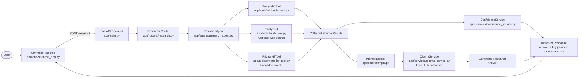
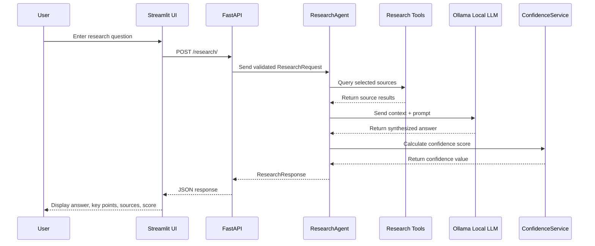

<div align="center">

# 🔎 Real-Time Research Copilot

### Local-first AI research assistant powered by FastAPI, Streamlit, Ollama, and multi-source retrieval

<p>
  
  
  
  
  
</p>

<p>
  <b>Ask a question → search multiple sources → synthesize a grounded answer → return sources and confidence score.</b>
</p>

<p>
  <a href="#-overview">Overview</a> •
  <a href="#-features">Features</a> •
  <a href="#-architecture">Architecture</a> •
  <a href="#-quick-start">Quick Start</a> •
  <a href="#-project-structure">Project Structure</a> •
  <a href="#-roadmap">Roadmap</a>
</p>

</div>

---

## 📌 Overview

**Real-Time Research Copilot** is a local-first AI research assistant that helps users answer questions using multiple information sources while keeping LLM inference on the local machine.

The application combines a **Streamlit frontend**, **FastAPI backend**, modular research tools, and a local **Ollama LLM** to generate structured research responses with source references and a confidence score.

This project is designed as a practical AI Engineer portfolio project because it demonstrates:

- Local LLM integration with Ollama
- Multi-source research orchestration
- Backend API design with FastAPI
- Interactive frontend development with Streamlit
- Modular tool design
- Confidence scoring and structured response generation
- Offline-friendly testing with mocked tools and services

---

## ✨ Key Highlights

| Area | What this project demonstrates |
|---|---|
| 🧠 AI Engineering | Local LLM-based answer synthesis using Ollama |
| 🔍 Retrieval | Wikipedia, optional Tavily web search, and private knowledge base support |
| 🔐 Privacy | No OpenAI or cloud AI model required for inference |
| ⚙️ Backend | FastAPI endpoints, routers, schemas, services, and clean separation of concerns |
| 🖥️ Frontend | Streamlit UI with source selection, confidence display, and expandable result cards |
| 🧪 Testing | Offline test suite using mocks for tools, APIs, and model calls |
| 🧱 Extensibility | Add new research tools without rewriting the agent logic |

---

## 🚀 Features

- **Multi-source research** using Wikipedia, optional Tavily web search, and private local documents
- **Local LLM inference** through Ollama models such as `llama3.2`, `gemma2`, `phi3`, and `mistral`
- **No cloud AI dependency** for response generation
- **Confidence score** based on source count, source diversity, and content richness
- **Private knowledge base support** using local `.txt` files
- **Modular tool system** for easily adding new data sources
- **Structured output** with answer, key points, sources, and confidence badge
- **Streamlit frontend** for a simple and interactive research workflow
- **Offline test suite** with 31 tests that do not require Ollama, Tavily, or live internet access

---

## 🏗️ Architecture

The application follows a clean **frontend → API → agent → tools/services → response** architecture.
Instead of a single monolithic script, each layer has a clear responsibility.



### 🧩 Component Mapping

| Layer | File / Folder | Responsibility |
|---|---|---|
| User Interface | `frontend/streamlit_app.py` | Provides the interactive UI where the user enters a question, selects sources, and views the final answer. |
| API Entry Point | `app/main.py` | Creates the FastAPI application, registers routers, enables middleware, and exposes health checks. |
| API Router | `app/routers/research.py` | Handles the `POST /research/` request and passes the user query to the research agent. |
| Agent Layer | `app/agents/research_agent.py` | Orchestrates the full workflow: source search, LLM synthesis, and confidence scoring. |
| Tool Interface | `app/tools/base_tool.py` | Defines the common interface that every research tool must follow. |
| Wikipedia Search | `app/tools/wikipedia_tool.py` | Retrieves public background information from Wikipedia. |
| Web Search | `app/tools/tavily_tool.py` | Optionally retrieves live web results when a Tavily API key is configured. |
| Private Knowledge Base | `app/tools/private_kb_tool.py` | Searches local `.txt` files stored in `app/data/private_docs/`. |
| Prompting | `app/core/prompts.py` | Builds the structured prompt sent to the local LLM. |
| Local LLM Service | `app/services/ollama_service.py` | Sends collected context to Ollama and parses the model response. |
| Confidence Scoring | `app/services/confidence_service.py` | Calculates a confidence score using source count, source diversity, and content richness. |
| Schemas | `app/models/schemas.py` | Defines request and response models such as `ResearchRequest`, `SourceResult`, and `ResearchResponse`. |
| Configuration | `app/core/config.py` | Loads environment variables such as Ollama model name, Tavily key, and vector store path. |
| Tests | `tests/` | Validates API behavior, tool interfaces, and confidence scoring using offline mocks. |

### 🔁 Request Flow



### 🗺️ Source-to-Answer Mapping

| Step | Input | Process | Output |
|---:|---|---|---|
| 1 | User question | Streamlit collects the query and selected sources | API request |
| 2 | API request | FastAPI validates request schema | `ResearchRequest` |
| 3 | Validated request | `ResearchAgent` calls selected tools | List of `SourceResult` objects |
| 4 | Sources + question | Prompt builder creates grounded synthesis prompt | LLM-ready prompt |
| 5 | Prompt | Ollama generates the final research answer locally | Answer + key points |
| 6 | Retrieved sources | Confidence service scores source quality | Confidence score from 0 to 1 |
| 7 | Answer + sources + score | Backend returns structured response | Final result in Streamlit UI |

---

## 🛠️ Tech Stack

| Layer | Technology |
|---|---|
| Frontend | Streamlit |
| Backend | FastAPI, Uvicorn |
| Local LLM | Ollama (`llama3.2`, `gemma2`, `phi3`, `mistral`) |
| Embeddings | Ollama `nomic-embed-text` *(planned / Milestone 7)* |
| Vector Database | FAISS local vector store *(planned / Milestone 7)* |
| Web Search | Tavily API *(optional)* |
| Wikipedia Search | Wikipedia REST API |
| Validation | Pydantic v2 |
| Configuration | pydantic-settings, python-dotenv |
| Testing | pytest, httpx |

---

## ⚡ Quick Start

### 1. Clone the repository

```bash
git clone https://github.com/Kenil-Sutariya/ml-projects.git
cd ml-projects/realtime-reseach-copilot
```

### 2. Create and activate a virtual environment

```bash
python3 -m venv .venv
source .venv/bin/activate
```

For Windows:

```bash
.venv\Scripts\activate
```

### 3. Install dependencies

```bash
pip install -r requirements.txt
```

### 4. Install and configure Ollama

Download and install Ollama from the official website.

Then pull at least one local chat model:

```bash
ollama pull llama3.2
```

Optional lightweight alternatives:

```bash
ollama pull gemma2:2b
ollama pull phi3
```

Embedding model for future vector search milestone:

```bash
ollama pull nomic-embed-text
```

Check installed models:

```bash
ollama list
```

### 5. Configure environment variables

```bash
cp .env.example .env
```

Example `.env` configuration:

```env
OLLAMA_BASE_URL=http://localhost:11434
OLLAMA_CHAT_MODEL=llama3.2
OLLAMA_EMBEDDING_MODEL=nomic-embed-text
TAVILY_API_KEY=
VECTORSTORE_PATH=app/data/vectorstore
API_BASE_URL=http://localhost:8000
```

> Tavily is optional. Leave `TAVILY_API_KEY` empty if you only want Wikipedia and local private knowledge base search.

---

## ▶️ Running the Application

### Terminal 1 — Start the FastAPI backend

```bash
source .venv/bin/activate
uvicorn app.main:app --reload
```

Available backend routes:

| Route | Purpose |
|---|---|
| `http://localhost:8000` | API root |
| `http://localhost:8000/docs` | Swagger UI |
| `http://localhost:8000/health` | Health check |
| `POST /research/` | Main research endpoint |

### Terminal 2 — Start the Streamlit frontend

```bash
source .venv/bin/activate
streamlit run frontend/streamlit_app.py
```

Open the app at:

```text
http://localhost:8501
```

---

## 🧪 Running Tests

```bash
pytest tests/ -v
```

The test suite runs fully offline:

```text
31 passed in ~46s
```

No real Ollama server, Tavily key, or internet connection is required because external calls are mocked.

---

## 💡 Example Queries

| Query | Recommended Sources |
|---|---|
| What is quantum entanglement? | Wikipedia |
| Explain the transformer architecture. | Wikipedia + Web |
| What is our company AI usage policy? | Private KB |
| Who are the best performing LLMs right now? | Wikipedia + Tavily |
| Summarize the main risks of local LLM deployment. | Wikipedia + Web + Private KB |

---

## 📦 Environment Variables

| Variable | Required | Default | Description |
|---|---:|---|---|
| `OLLAMA_BASE_URL` | No | `http://localhost:11434` | URL where the Ollama server is running |
| `OLLAMA_CHAT_MODEL` | Yes | `llama3.2` | Local model used for answer synthesis |
| `OLLAMA_EMBEDDING_MODEL` | No | `nomic-embed-text` | Embedding model for future vector search |
| `TAVILY_API_KEY` | No | Empty | Enables optional live web search |
| `VECTORSTORE_PATH` | No | `app/data/vectorstore` | Local FAISS index location |
| `API_BASE_URL` | No | `http://localhost:8000` | Backend URL used by the Streamlit frontend |

---

## 📁 Project Structure

```text
research_copilot/
├── app/
│   ├── main.py                    # FastAPI app, CORS middleware, routers
│   ├── core/
│   │   ├── config.py              # Pydantic settings and .env loading
│   │   └── prompts.py             # System prompt and user prompt builder
│   ├── models/
│   │   └── schemas.py             # ResearchRequest, SourceResult, ResearchResponse
│   ├── routers/
│   │   └── research.py            # POST /research endpoint
│   ├── agents/
│   │   └── research_agent.py      # Orchestrates tools, LLM, and confidence scoring
│   ├── tools/
│   │   ├── base_tool.py           # Abstract BaseResearchTool interface
│   │   ├── wikipedia_tool.py      # Wikipedia REST API search
│   │   ├── tavily_tool.py         # Optional Tavily live web search
│   │   └── private_kb_tool.py     # Local .txt file search
│   ├── services/
│   │   ├── ollama_service.py      # Local LLM inference using ollama.chat()
│   │   ├── confidence_service.py  # Confidence score calculation
│   │   ├── embedding_service.py   # Ollama embeddings for future vector search
│   │   └── vector_store.py        # FAISS index service
│   └── data/
│       └── private_docs/          # Local private documents
│           └── sample_company_policy.txt
├── frontend/
│   └── streamlit_app.py           # Streamlit interface
├── tests/
│   ├── test_research_api.py       # API endpoint tests
│   ├── test_confidence_service.py # Confidence scoring tests
│   └── test_tools.py              # Tool interface and mock tests
├── .env.example
├── .gitignore
├── requirements.txt
└── README.md
```

---

## 🔐 Local-First Design

This project is intentionally designed to avoid cloud AI inference.

| Component | Local or Cloud? |
|---|---|
| Ollama LLM inference | Local |
| Private knowledge base | Local |
| FAISS vector store | Local |
| Wikipedia search | Internet source |
| Tavily web search | Optional cloud API |
| OpenAI / cloud LLMs | Not required |

The result is a practical architecture for research workflows where privacy, cost control, and local experimentation matter.

---

## 🧠 How Confidence Scoring Works

The confidence score is not a model hallucination score. It is a practical heuristic based on the quality of retrieved context.

It considers:

- Number of sources found
- Diversity of source types
- Amount of usable source content
- Whether the answer is supported by retrieved references

This makes the final response easier to interpret because the user can see whether the answer is based on rich evidence or limited context.

---

## 🧩 Adding a New Research Tool

The architecture is modular. To add a new source, create a new class that follows the `BaseResearchTool` interface.

Example future tools:

- Arxiv research paper search
- PDF document search
- Company internal documentation search
- GitHub repository search
- News search
- Local folder crawler

The `ResearchAgent` can then call the new tool without changing the overall app design.

---

## 🧯 Troubleshooting

| Problem | Solution |
|---|---|
| `[Errno 48] Address already in use` | Run `kill -9 $(lsof -ti :8000)` and restart the backend |
| `Model 'llama3.2' not found` | Run `ollama pull llama3.2` |
| Ollama connection refused | Open the Ollama app or run `ollama serve` |
| Tavily returns no results | Check `TAVILY_API_KEY` in `.env` |
| Wikipedia returns empty | Check your internet connection |
| First response is slow | Normal behavior while Ollama loads the model into memory |
| Streamlit cannot reach backend | Confirm FastAPI is running at `http://localhost:8000` |

---

## 🔮 Future Improvements

- Add semantic vector search for private documents using FAISS
- Add PDF ingestion for private research files
- Add ArxivTool for scientific paper search
- Add streaming answers with Server-Sent Events
- Add conversation history for multi-turn research sessions
- Add result caching for repeated queries
- Add Docker Compose for one-command local startup
- Add export options for Markdown, PDF, and JSON reports
- Add evaluation metrics for answer faithfulness and source coverage

---

## 👤 Author

**Kenil Sutariya**  
AI Engineer / ML Engineer Portfolio Project

<p>
  <a href="https://github.com/Kenil-Sutariya">
    
  </a>
  <a href="https://www.linkedin.com/in/Kenil-Sutariya/">
    
  </a>
</p>

---

<div align="center">

⭐ If this project helped you understand local-first AI research systems, consider starring the repository.

</div>
