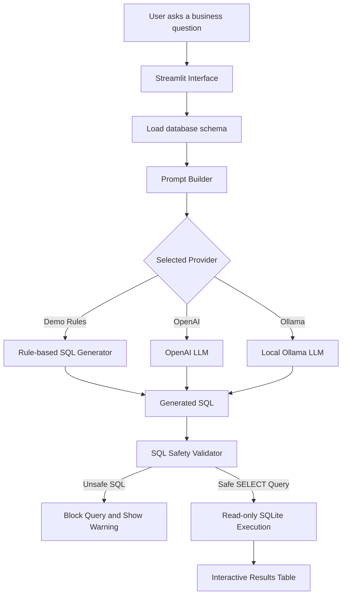
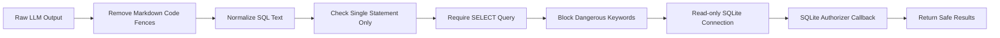

<div align="center">

# 🧠 AI-Powered SQL Query Generator

### Convert natural language questions into safe SQL queries and explore structured data with a clean Streamlit interface.

<p>
  
  
  
  
  
  
</p>

<p>
  <b>Ask a business question → generate SQL → validate safety → execute read-only query → view results instantly.</b>
</p>

</div>

---

## 📌 Overview

**AI-Powered SQL Query Generator** is a beginner-friendly AI Engineering and Data Engineering portfolio project that converts natural language questions into safe SQLite `SELECT` queries.

The app allows users to ask business questions, generate SQL using either **OpenAI**, **Ollama**, or a no-key **Demo Rules** mode, validate the generated query through safety guardrails, and run it against a sample sales database.

It also includes a **multi-CSV upload panel** that helps users inspect uploaded datasets by showing row counts, column counts, column names, and inferred data types.

This project demonstrates practical skills in:

- LLM-based application design
- Prompt engineering with database schema context
- SQL query generation
- SQL safety validation
- Read-only database execution
- CSV schema exploration
- Streamlit app development
- Modular Python testing with Pytest

---

## ✨ Key Highlights

| Area | What this project demonstrates |
|---|---|
| 🧠 AI Engineering | Natural language to SQL generation using OpenAI, Ollama, or demo rules |
| 🗄️ Data Engineering | SQLite database handling, schema extraction, and query execution |
| 🛡️ Safety | Guardrails that block destructive SQL commands before execution |
| 📊 Data Exploration | Multi-CSV upload support with automatic schema profiling |
| 🖥️ App Development | Interactive Streamlit interface for business-style querying |
| 🧪 Testing | Pytest coverage for database, safety, and dataset upload logic |
| 🔌 Flexibility | Works with cloud LLMs, local LLMs, or no API key at all |

---

## 🚀 Features

- Convert natural language questions into SQLite `SELECT` queries
- Support for **OpenAI**, **Ollama**, and offline **Demo Rules** mode
- Built-in SQLite sales database with `customers`, `products`, and `orders`
- Display generated SQL before execution for full transparency
- Block unsafe SQL commands such as `DROP`, `DELETE`, `UPDATE`, `INSERT`, `CREATE`, `ALTER`, and `PRAGMA`
- Execute approved SQL through a read-only SQLite connection
- Use SQLite authorizer callbacks to deny non-read database operations
- Upload multiple CSV files for schema discovery
- Show uploaded file name, row count, column count, column names, and inferred data types
- Run tests for database logic, SQL safety, and CSV parsing

---

## 🧭 Application Workflow



---

## 🛡️ SQL Safety Pipeline

The generated SQL is treated as **untrusted output**. Before the query reaches the database, it must pass several safety checks.



### Allowed example

```sql
SELECT product_name, category FROM products;
```

### Blocked examples

```sql
DROP TABLE customers;
DELETE FROM orders;
UPDATE products SET unit_price = 0;
INSERT INTO customers VALUES (99, 'Test', 'Nowhere', '2025-01-01');
```

---

## 🧩 Component Mapping

| Component | File | Responsibility |
|---|---|---|
| Streamlit UI | `app.py` | Main user interface for questions, providers, SQL output, results, and CSV upload |
| Database utilities | `src/sql_generator/database.py` | SQLite connection, schema extraction, query execution |
| Dataset utilities | `src/sql_generator/datasets.py` | CSV upload parsing and schema profiling |
| LLM provider logic | `src/sql_generator/llm.py` | OpenAI, Ollama, and demo-rule SQL generation |
| SQL safety layer | `src/sql_generator/safety.py` | SQL normalization, validation, blocked keywords, read-only protections |
| Database creation | `scripts/create_database.py` | Creates the local sample sales database |
| Tests | `tests/` | Unit tests for database, dataset, and safety logic |

---

## 🛠️ Tech Stack

| Layer | Tool |
|---|---|
| App | Streamlit |
| Language | Python |
| Database | SQLite |
| Data handling | Pandas |
| LLM providers | OpenAI, Ollama, Demo Rules |
| Safety | SQL validation + read-only SQLite execution |
| Testing | Pytest |

---

## 📁 Project Structure

```text
ai-sql-query-generator/
├── app.py
├── data/
│   └── sales.db
├── examples/
│   ├── example_questions.md
│   └── sample_upload.csv
├── scripts/
│   └── create_database.py
├── src/
│   └── sql_generator/
│       ├── database.py
│       ├── datasets.py
│       ├── llm.py
│       └── safety.py
├── tests/
│   ├── test_database.py
│   ├── test_datasets.py
│   └── test_safety.py
├── requirements.txt
└── README.md
```

---

## ⚡ Quick Start

### 1. Clone the repository

```bash
git clone https://github.com/Kenil-Sutariya/ml-projects.git
cd ai-sql-query-generator
```

### 2. Create and activate a virtual environment

```bash
python -m venv .venv
source .venv/bin/activate
```

For Windows:

```bash
.venv\Scripts\activate
```

### 3. Install dependencies

```bash
pip install -r requirements.txt
```

### 4. Create the sample database

```bash
python scripts/create_database.py
```

### 5. Run the Streamlit app

```bash
streamlit run app.py
```

Open the local Streamlit URL shown in your terminal.

> The default **Demo Rules** provider works immediately without an API key.

---

## 🔑 Provider Modes

### 1. Demo Rules Mode

Use this mode when you want the project to run without an API key.

Best for:

- Fast demos
- Portfolio walkthroughs
- Testing the UI
- Showing SQL safety behavior

---

### 2. OpenAI Mode

Set your API key before starting Streamlit:

```bash
export OPENAI_API_KEY="your_api_key_here"
streamlit run app.py
```

Then select **OpenAI** in the sidebar.

---

### 3. Ollama Mode

Install Ollama locally, pull a model, and start the Ollama server:

```bash
ollama pull llama3.1
ollama serve
streamlit run app.py
```

Then select **Ollama** in the sidebar.

---

## 💬 Example Questions

Try these prompts in the app:

| Question | Expected behavior |
|---|---|
| Show total sales by month | Generates a grouped revenue query |
| Which products have the highest sales? | Ranks products by sales/revenue |
| Show total revenue by customer | Aggregates order revenue by customer |
| Show sales by product category | Groups results by product category |
| Show the latest orders | Returns recent order records |
| Drop the customers table | Blocked by the safety layer |

---

## 📤 CSV Upload and Schema Discovery

The upload panel supports multiple CSV files at once.

For every uploaded CSV file, the app displays:

- File name
- Row count
- Column count
- Column names
- Inferred data types

You can test this feature with:

```text
examples/sample_upload.csv
```

This feature is useful because it shows how the project could later support user-uploaded datasets and natural language querying over custom data.

---

## 🧪 Run Tests

```bash
pytest
```

Current tests cover:

- Sample database creation
- SQL query execution
- SQL safety validation
- Read-only database protection
- CSV upload parsing
- Schema profiling
  
---

## 🛣️ Future Improvements

- Convert uploaded CSV files into temporary SQLite tables
- Allow users to ask questions across uploaded datasets
- Add plain-English explanations for generated SQL
- Add SQL evaluation cases comparing expected SQL to generated SQL
- Add optional FastAPI endpoint for programmatic access
- Add Docker support for easier deployment
- Add query history and saved results
- Add chart generation for query outputs
- Add role-based access for sensitive datasets

---

## 👤 Author

**Kenil Sutariya**

- GitHub: [@Kenil-Sutariya](https://github.com/Kenil-Sutariya)
- LinkedIn: [Kenil Sutariya](https://www.linkedin.com/in/Kenil-Sutariya/)

---

<div align="center">

### ⭐ If you like this project, consider giving it a star.

</div>
