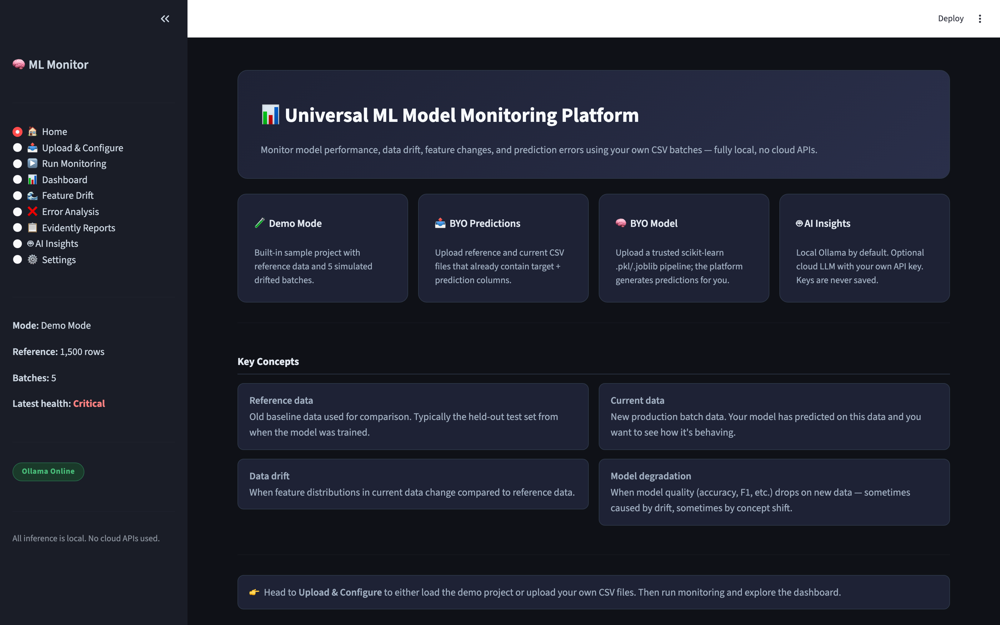
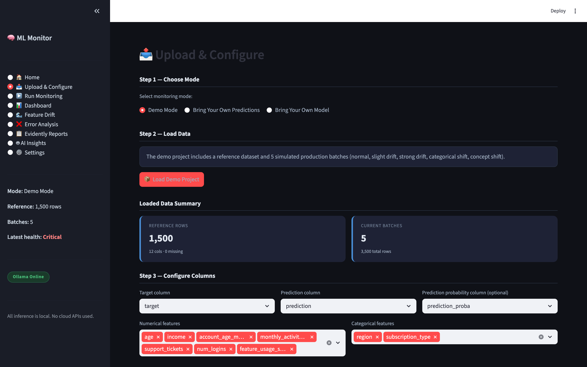
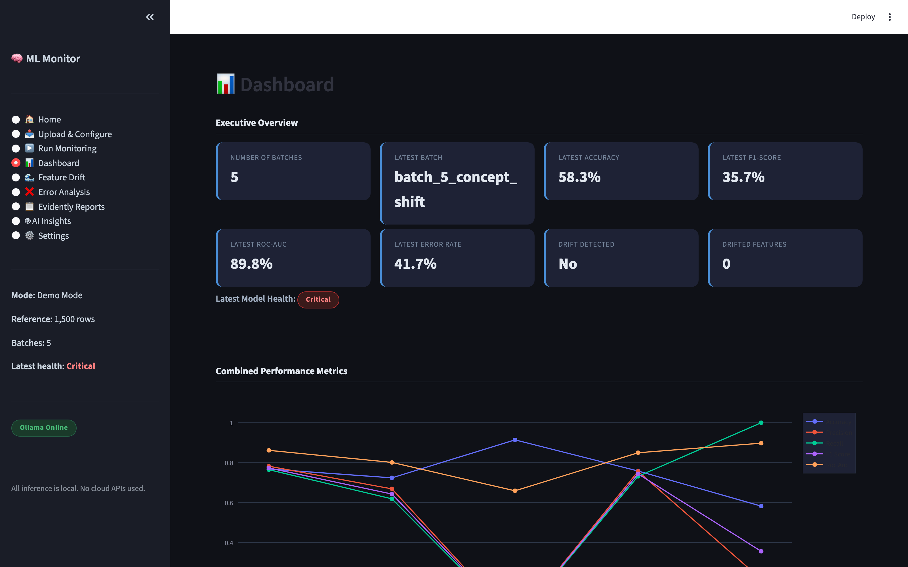
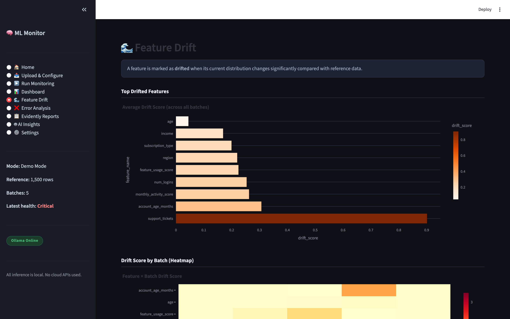
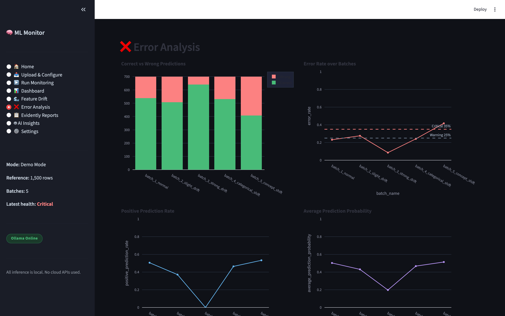
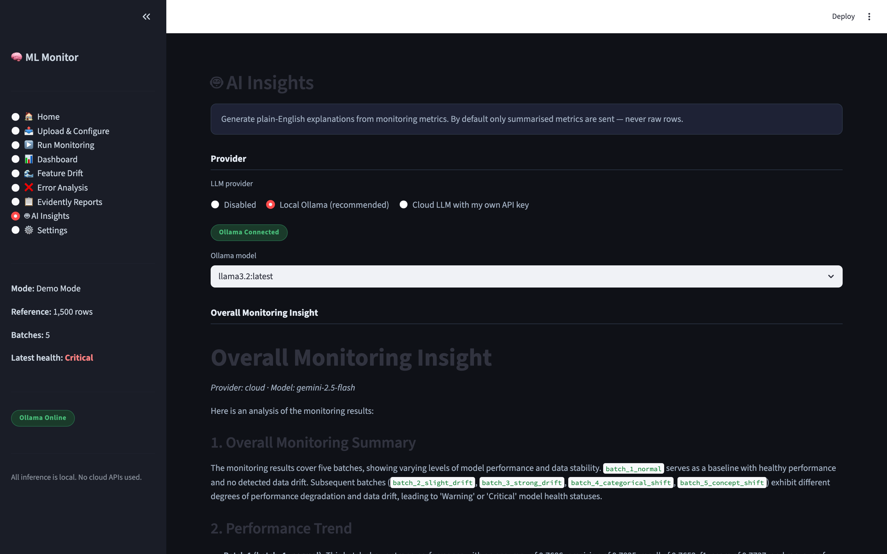

<div align="center">

# 📊 Universal ML Model Monitoring Platform

**Monitor any classification model in production — fully local, no cloud required.**

[](https://python.org)
[](https://streamlit.io)
[](https://evidentlyai.com)
[](https://ollama.com)
[](LICENSE)

*Detect data drift · Track performance decay · Explain everything in plain English*

</div>

---

## 🧭 What This Project Does

After a model is deployed, it silently degrades. Feature distributions shift, accuracy falls, and nobody notices until the incident report lands.

**Universal ML Model Monitoring Platform** is a fully-local Streamlit web app that compares every fresh production batch against a stable reference dataset and answers three questions automatically:

1. **Is the model still accurate?** — tracks accuracy, F1, ROC-AUC, error rate per batch
2. **Is the data drifting?** — detects numerical mean-shift and categorical distribution changes per feature
3. **Why?** — asks a local LLM (or cloud LLM with your own key) to write a plain-English explanation

Everything runs on your machine. No data leaves your environment by default.

---

## ✨ Features at a Glance

| Feature | Detail |
|---|---|
| 🧪 **Demo Mode** | One click — loads 5 simulated drift batches, no data preparation needed |
| 📤 **BYO Predictions** | Upload your own reference + batch CSVs that already contain predictions |
| 🧠 **BYO Model** | Upload a scikit-learn `.pkl` / `.joblib`; the platform generates predictions for you |
| 📊 **9-page Dashboard** | Home, Upload, Run Monitoring, Dashboard, Feature Drift, Error Analysis, Evidently Reports, AI Insights, Settings |
| 🌊 **Drift Detection** | Mean-shift score for numerical features; total variation distance for categorical |
| 📋 **Evidently Reports** | Data drift, model performance, data summary HTML reports — rendered inline |
| 🤖 **AI Insights** | Local Ollama (default) or cloud LLM (OpenAI / Groq / Gemini / OpenRouter / Custom) |
| 🔒 **Privacy-first** | API keys never written to disk; raw rows never sent to LLMs by default |

---

## 🖥️ Screenshots

<table>
  <tr>
    <td align="center"><b>🏠 Home</b></td>
    <td align="center"><b>📤 Upload & Configure</b></td>
  </tr>
  <tr>
    <td></td>
    <td></td>
  </tr>
  <tr>
    <td align="center"><b>📊 Dashboard</b></td>
    <td align="center"><b>🌊 Feature Drift</b></td>
  </tr>
  <tr>
    <td></td>
    <td></td>
  </tr>
  <tr>
    <td align="center"><b>❌ Error Analysis</b></td>
    <td align="center"><b>🤖 AI Insights</b></td>
  </tr>
  <tr>
    <td></td>
    <td></td>
  </tr>
</table>

---

## ⚡ Quick Start

### 1. Install

```bash
git clone https://github.com/your-username/universal-ml-monitoring-platform
cd universal-ml-monitoring-platform

python3.12 -m venv venv
source venv/bin/activate        # Windows: venv\Scripts\activate

pip install -r requirements.txt
```

### 2. Run

```bash
streamlit run app.py
# → opens http://localhost:8501
```

### 3. Try the demo (60 seconds)

```
Upload & Configure  →  Demo Mode  →  📦 Load Demo Project
Run Monitoring      →  🚀 Run Monitoring
Dashboard           →  see results
```

---

## 🗂️ Three Monitoring Modes

### 🧪 Demo Mode

Zero configuration. Loads 1 reference dataset (1,500 rows) and 5 production batches simulating progressive drift:

| Batch | Drift Type | Expected Health |
|---|---|---|
| `batch_1_normal` | None | 🟢 Healthy |
| `batch_2_slight_drift` | Mild mean shift | 🟡 Warning |
| `batch_3_strong_drift` | Heavy shift on 5 features | 🔴 Critical |
| `batch_4_categorical_shift` | Distribution flip | 🟡 Warning |
| `batch_5_concept_shift` | Feature-target relationship changed | 🔴 Critical |

### 📤 Bring Your Own Predictions

Your CSVs must contain: `target`, `prediction`, and optionally `prediction_proba`. Upload reference + one or more current batches, pick columns, validate, and run.

### 🧠 Bring Your Own Model

Upload a trusted scikit-learn `Pipeline` (`.pkl` or `.joblib`) + raw feature CSVs. The platform calls `model.predict()` and `model.predict_proba()` automatically, then runs the full monitoring pipeline.

> ⚠️ Pickle files can execute arbitrary code. A security trust checkbox is required before any model file is loaded.

---

## 🏗️ Architecture

```
Reference CSV  ──┐
                 ├──► Schema Validator ──► Monitoring Pipeline
Current Batches ─┘                           │
                                   ┌─────────┼──────────┐
                                   ▼         ▼          ▼
                               Metrics    Drift     Evidently
                             Calculator  Analyzer    Reports
                                   │         │          │
                                   ▼         ▼          ▼
                          monitoring_summary.csv      *.html
                          feature_drift_details.csv
                                   │
                                   ▼
                            LLM Router
                           ┌────────────┐
                           ▼            ▼
                      Local Ollama  Cloud LLM
                           │            │
                           └────┬───────┘
                                ▼
                         AI Insights .md
                                │
                                ▼
                       Streamlit Dashboard
```

### Source Code Map

```
universal-ml-monitoring-platform/
├── app.py                          # Streamlit UI — 9 pages
├── config/app_config.yaml          # thresholds + LLM defaults
├── prompts/                        # LLM prompt templates
├── src/
│   ├── utils.py                    # paths, config, CSV helpers
│   ├── schema_validator.py         # column inference + validation
│   ├── data_profiler.py            # lightweight DataFrame profiling
│   ├── metrics_calculator.py       # accuracy, F1, ROC-AUC, health label
│   ├── drift_analyzer.py           # mean-shift + total variation detectors
│   ├── evidently_runner.py         # Evidently HTML report generation
│   ├── model_loader.py             # trusted .pkl/.joblib loader
│   ├── prediction_engine.py        # run predictions from uploaded model
│   ├── monitoring_pipeline.py      # end-to-end orchestration
│   ├── ollama_client.py            # Ollama HTTP client
│   ├── cloud_llm_client.py         # OpenAI-compatible cloud client
│   ├── llm_providers.py            # 5 cloud presets + .env key loader
│   ├── llm_router.py               # routes disabled / ollama / cloud
│   └── ai_insights.py              # prompt builder + insight generator
├── sample_project/                 # bundled demo data + sample model
├── workspace/                      # all runtime outputs (gitignored)
└── tests/                          # smoke tests + provider comparison
```

---

## 🤖 AI Insights

### Local Ollama (recommended — fully private)

```bash
# macOS
brew install ollama
ollama serve
ollama pull llama3.2:latest   # recommended
```

The platform auto-selects the best installed model. Nothing leaves your machine.

### Cloud LLM (optional)

Copy `.env.example` to `.env` and add any key:

```env
OPENAI_API_KEY=sk-...
GROQ_API_KEY=gsk_...
GEMINI_API_KEY=AIza...
OPENROUTER_API_KEY=sk-or-...
```

**Supported presets:**

| Provider | Default Model | Notes |
|---|---|---|
| OpenAI | `gpt-4o-mini` | Best quality |
| Groq | `llama-3.3-70b-versatile` | ~1.5 s — fastest option |
| Gemini | `gemini-2.5-flash` | Free tier available |
| OpenRouter | `openai/gpt-4o-mini` | Access 100+ models |
| Custom | — | Any OpenAI-compatible endpoint |

> Keys are kept in Streamlit session memory only — never written to logs or disk.

---

## 📈 Drift Detection

### Numerical Features — Mean-Shift Score

```python
score = abs(current_mean - reference_mean) / max(reference_std, 1e-9)
# default threshold: score > 0.5 → drift detected
```

### Categorical Features — Total Variation Distance

```python
score = sum(abs(ref_dist[c] - cur_dist[c]) for c in all_categories) / 2
# default threshold: score > 0.25 → drift detected
```

Both thresholds are adjustable from the Settings page.

---

## 🏥 Model Health Logic

```python
if error_rate > 0.35 or f1 < 0.60:
    health = "Critical"   # 🔴
elif drift_detected or error_rate > 0.25 or f1 < 0.70:
    health = "Warning"    # 🟡
else:
    health = "Healthy"    # 🟢
```

All four threshold values are configurable via Settings sliders.

---

## 📦 Output Files

| File | Description |
|---|---|
| `workspace/summaries/monitoring_summary.csv` | One row per batch — all KPIs + model health |
| `workspace/summaries/feature_drift_details.csv` | One row per (batch, feature) — drift score |
| `workspace/reports/data_drift/*.html` | Evidently data drift report per batch |
| `workspace/reports/model_performance/*.html` | Evidently classification report per batch |
| `workspace/reports/data_summary/*.html` | Evidently data summary per batch |
| `workspace/ai_insights/*.md` | LLM-generated plain-English explanations |
| `workspace/processed/*.csv` | Each batch as used in the pipeline (predictions added) |

---

## 🛠️ Tech Stack

| Tool | Version | Purpose |
|---|---|---|
| Python | 3.10 / 3.12 | Core language |
| Streamlit | 1.x | Multi-page dashboard UI |
| Pandas + NumPy | latest | Data manipulation |
| Scikit-learn | latest | Classification metrics |
| Evidently | 0.6.7 | HTML drift + performance reports |
| Plotly | latest | Interactive charts |
| Requests | latest | Ollama + cloud LLM HTTP client |
| PyYAML | latest | App configuration |

---

## 🔒 Privacy & Security

- **Nothing leaves your machine** — all inference and reporting runs locally
- **No telemetry** — zero outbound calls except to your Ollama server or chosen cloud endpoint
- **Only summaries sent to LLMs** — raw rows are never transmitted by default
- **Raw-row toggle is OFF** — enable it explicitly in Settings if needed
- **Model trust checkbox** — `.pkl` / `.joblib` files are never loaded without explicit confirmation
- **API keys session-only** — loaded into `st.session_state` only; never written to logs, disk, or git

---

## ⚙️ Configuration

Edit `config/app_config.yaml` to change default thresholds and LLM settings:

```yaml
monitoring:
  drift_numeric_threshold:     0.5    # mean-shift threshold
  drift_categorical_threshold: 0.25   # TVD threshold
  warning_error_rate:          0.25
  critical_error_rate:         0.35
  warning_f1_threshold:        0.70
  critical_f1_threshold:       0.60

llm:
  default_provider: "local_ollama"
  local_ollama_url: "http://localhost:11434"
  default_ollama_model_priority:
    - "llama3.2:latest"
    - "phi3:latest"
    - "gemma2:2b"
```

---

## 🧪 Tests

```bash
# End-to-end smoke tests (14 tests)
python -m pytest tests/test_full_stack.py -v

# Train test models for BYO Model testing
python tests/train_test_models.py

# Test all configured cloud LLM providers
python tests/test_cloud_keys.py

# Side-by-side LLM provider comparison
python tests/compare_providers.py
```

---

## 🔭 Troubleshooting

| Symptom | Fix |
|---|---|
| Dashboard shows "No monitoring run found" | Go to Run Monitoring → 🚀 Run Monitoring |
| Ollama always times out | Add `OLLAMA_TIMEOUT=600` to `.env`, or use `phi3:latest` |
| Cloud LLM 429 error (Gemini) | Switch model to `gemini-2.5-flash` |
| `pip install` fails (Python 3.14) | Use Python 3.10 or 3.12 |
| Stale workspace / old results showing | Settings → 🧹 Clear Workspace |
| Mode radio needs 2 clicks | Ensure you're running the latest `app.py` |

---

## 🗺️ Roadmap

- [ ] Database connectors (Snowflake, BigQuery, PostgreSQL)
- [ ] Scheduled monitoring runs with email / Slack alerts
- [ ] Multi-class and regression task support
- [ ] PSI / KS / chi-squared drift tests per feature
- [ ] MLflow / Weights & Biases integration
- [ ] Docker Compose one-command deployment
- [ ] Multi-user authentication + per-team workspaces

---

## 📄 Documentation

| Document | Purpose |
|---|---|
| **`README.md`** | This file — overview, quick start, reference |
| **`WORKFLOW.md`** | Step-by-step visual workflow with diagrams and screenshots |
| **`DOCS_NEW.md`** | Full user guide — every page, every setting, every output file |

---

## 📝 License

MIT — see [LICENSE](LICENSE) for details.

---

<div align="center">

Built with ❤️ using Streamlit · Evidently · Ollama · Plotly

</div>
